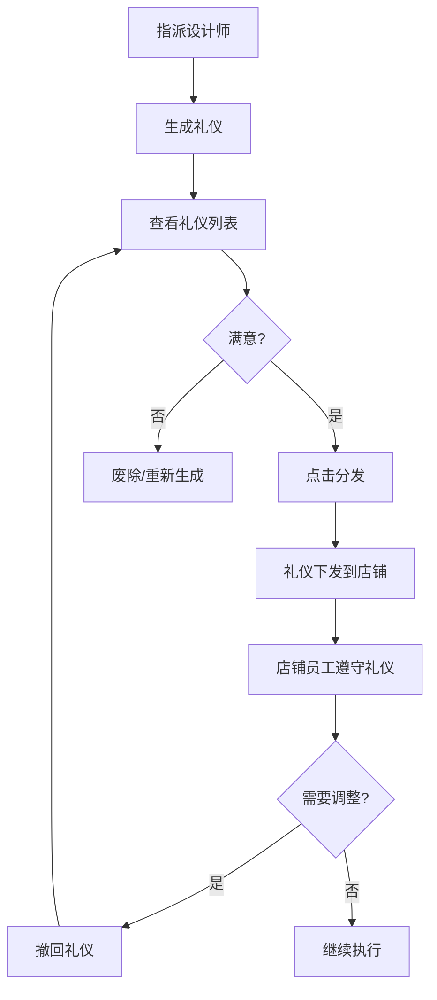

# 礼仪分发系统设计文档

## 概述

礼仪分发系统是礼仪设计馆的核心功能，用于将设计好的礼仪规范分发到各个店铺，让店铺里的奴仆（员工/人物卡牌）遵守这些礼仪。

## 系统架构

```
┌─────────────────────────────────────────────────────────────┐
│                      礼仪设计馆                              │
│  ┌─────────────┐    ┌─────────────┐    ┌─────────────┐     │
│  │ 语言铁律    │    │ 行为着装铁律 │    │ 主题周活动  │     │
│  └──────┬──────┘    └──────┬──────┘    └─────────────┘     │
│         │                  │                                │
│         └────────┬─────────┘                                │
│                  ▼                                          │
│         ┌───────────────┐                                   │
│         │   分发系统     │                                   │
│         └───────┬───────┘                                   │
└─────────────────┼───────────────────────────────────────────┘
                  │
    ┌─────────────┼─────────────┐
    ▼             ▼             ▼
┌───────┐   ┌───────┐   ┌───────┐
│ 青楼  │   │ 医馆  │   │ 大牢  │  ...更多店铺
└───┬───┘   └───┬───┘   └───┬───┘
    │           │           │
    ▼           ▼           ▼
┌───────┐   ┌───────┐   ┌───────┐
│ 花魁  │   │ 护士  │   │ 狱卒  │  ...各岗位员工
│ 导师  │   │ 医师  │   │ 刑讯官│
│ 护卫  │   │       │   │       │
└───────┘   └───────┘   └───────┘
```

## 场景与店铺映射

| 场景代码 | 场景名称 | 对应店铺 | 岗位 |
|---------|---------|---------|------|
| `brothel` | 青楼 | 青楼 | 头牌花魁、双修导师、护卫 |
| `arena` | 角斗场 | 角斗场 | 明星角斗士、主持人、奴隶商人 |
| `alchemy` | 炼丹房 | 炼丹房 | 首席炼丹师、药童 |
| `auction` | 拍卖行 | 拍卖行 | 首席拍卖师、鉴宝师 |
| `intelligence` | 情报阁 | 情报阁 | 情报头子、暗杀者 |
| `hospital` | 医馆 | 医馆 | 主治医师、护士 |
| `prison` | 大牢 | 大牢 | 狱长、狱卒、刑讯官 |
| `etiquette_hall` | 礼仪馆 | 礼仪馆 | 礼仪设计师、礼仪督察 |
| `general` | 通用 | 所有店铺 | 所有岗位 |

## 核心类型定义

### 分发记录 (EtiquetteDistribution)

```typescript
interface EtiquetteDistribution {
  shopType: ShopTypeForEtiquette;  // 分发到的店铺类型
  shopId?: string;                  // 具体店铺ID
  positionIds: string[];            // 适用的岗位ID列表
  distributedAt: number;            // 分发时间戳
  distributedBy?: string;           // 分发者ID
  status: DistributionStatus;       // 分发状态
  recalledAt?: number;              // 撤回时间戳
}
```

### 礼仪新增字段

语言铁律和行为着装铁律都新增了以下字段：

```typescript
{
  applicablePositions?: string[];     // 适用岗位ID列表
  distributions: EtiquetteDistribution[]; // 分发记录
  isDistributed: boolean;             // 是否已分发
}
```

## 功能说明

### 1. 礼仪生成

AI 生成礼仪时会：
- 根据启用的场景生成对应的礼仪
- 自动关联场景对应的岗位
- 使用岗位名称作为适用角色

### 2. 礼仪分发

点击礼仪卡片上的「📤 分发」按钮：
- 系统根据礼仪的场景自动确定目标店铺
- 创建分发记录，包含店铺类型和适用岗位
- 礼仪状态变为「已分发」

### 3. 礼仪撤回

点击「📥 撤回」按钮：
- 将分发记录状态改为「已撤回」
- 礼仪状态变为「未分发」
- 店铺将不再执行此礼仪

### 4. 分发状态显示

已分发的礼仪会显示：
- 绿色标签显示分发到的店铺
- 分发按钮变为撤回按钮
- 已分发的礼仪不能被废除（需先撤回）

## 使用流程



## 后续开发计划

### 已完成 ✅
- [x] 类型定义更新
- [x] AI 生成提示词优化
- [x] 分发/撤回功能
- [x] 分发状态显示

### 待开发 🚧
- [ ] 店铺界面显示已分发的礼仪
- [ ] 礼仪执行追踪（记录执行次数）
- [ ] 违反礼仪的惩罚机制
- [ ] 通用礼仪的多店铺分发选择
- [ ] 礼仪预览功能
- [ ] 礼仪微调功能

## 代码文件

| 文件 | 说明 |
|-----|------|
| `types/etiquette.ts` | 礼仪系统类型定义 |
| `services/etiquetteGenerationService.ts` | AI 生成服务 |
| `components/EtiquetteHallModal.tsx` | 礼仪设计馆主界面 |
| `components/EtiquetteSettingsModal.tsx` | 设置界面 |

## 注意事项

1. **场景匹配**：礼仪的场景必须与店铺类型匹配才能分发
2. **通用礼仪**：`general` 场景的礼仪需要手动选择分发目标（功能待开发）
3. **撤回限制**：撤回后分发记录会保留，状态变为 `recalled`
4. **废除限制**：已分发的礼仪不能直接废除，需要先撤回