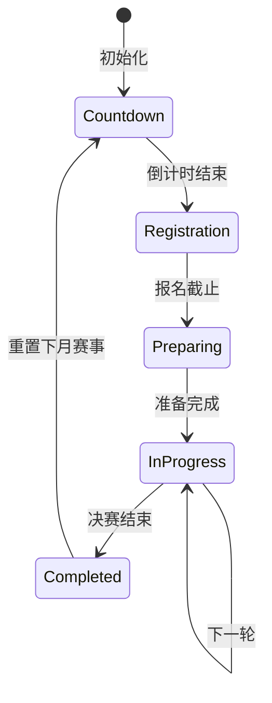
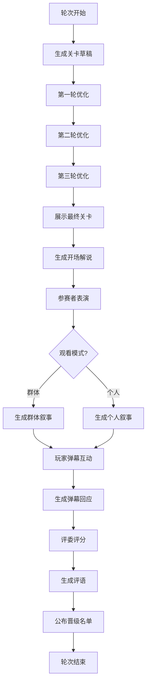

# 大闯关赛事系统设计文档

## 系统概述

"大闯关"是一个类似"男生女生向前冲"的综艺闯关赛事系统，每月举行一次，64名女性参赛者通过6轮淘汰赛角逐冠军。

### 核心特点
- **赛制**：64人→32人→16人→8人→4人→2人→1人（6轮淘汰赛）
- **周期**：每月一次，有倒计时系统
- **关卡**：每轮不同关卡，玩法多样（解谜、竞技、体能等）
- **AI驱动**：关卡设计、三轮优化、动画叙事、弹幕互动全部由AI生成
- **观看模式**：可聚焦单个参赛者或群体表现

---

## 第一阶段：类型定义和数据结构设计

### 1.1 核心类型定义 (types/gauntlet.types.ts)

```typescript
// 赛事状态
type GauntletStatus = 'countdown' | 'registration' | 'preparing' | 'in_progress' | 'completed';

// 轮次状态
type RoundStatus = 'pending' | 'design_draft' | 'optimizing' | 'ready' | 'in_progress' | 'judging' | 'completed';

// 参赛者状态
type ContestantStatus = 'active' | 'eliminated' | 'winner';

// 关卡类型
type ChallengeType = '解谜' | '竞技' | '体能' | '技巧' | '智力' | '综合';

// 简化参赛者信息
interface GauntletContestant {
  id: string;
  name: string;
  title?: string;           // 称号
  origin?: string;          // 来历
  appearance?: string;      // 简短外观描述
  specialTrait?: string;    // 特殊特点
  status: ContestantStatus;
  eliminatedRound?: number; // 被淘汰的轮次
  isPlayerCharacter: boolean;
  characterCardId?: string; // 如果是玩家角色，关联的卡牌ID
}

// 评委
interface GauntletJudge {
  id: string;
  name: string;
  title: string;
  personality: string;      // 评委性格特点
  judgingStyle: string;     // 评判风格
  avatar?: string;
}

// 关卡设计
interface ChallengeDesign {
  id: string;
  roundNumber: number;
  type: ChallengeType;
  name: string;
  description: string;
  rules: string[];
  winCondition: string;
  eliminationCriteria: string;
  difficulty: number;       // 1-10
  estimatedDuration: string;
  
  // 三轮优化记录
  draftVersion: string;
  optimizations: ChallengeOptimization[];
  finalVersion: string;
}

// 关卡优化记录
interface ChallengeOptimization {
  round: 1 | 2 | 3;
  critique: string;         // 批判内容
  suggestions: string[];    // 优化建议
  changes: string[];        // 实际修改
  optimizedDesign: string;  // 优化后的设计
}

// 参赛者表现
interface ContestantPerformance {
  contestantId: string;
  roundNumber: number;
  score: number;            // 0-100
  rank: number;             // 本轮排名
  highlights: string[];     // 精彩表现
  mistakes: string[];       // 失误
  narrative: string;        // AI生成的表现叙事
  passed: boolean;          // 是否晋级
}

// 评委评分
interface JudgeScore {
  judgeId: string;
  contestantId: string;
  roundNumber: number;
  score: number;            // 0-100
  comment: string;          // 评语
}

// 弹幕
interface Danmaku {
  id: string;
  content: string;
  timestamp: number;
  type: 'viewer' | 'player' | 'system';
  color?: string;
}

// 解说
interface Commentary {
  id: string;
  roundNumber: number;
  phase: 'opening' | 'during' | 'highlight' | 'closing';
  content: string;
  timestamp: number;
}

// 轮次数据
interface GauntletRound {
  roundNumber: number;      // 1-6
  status: RoundStatus;
  challenge: ChallengeDesign;
  contestants: string[];    // 参赛者ID列表
  performances: ContestantPerformance[];
  judgeScores: JudgeScore[];
  commentary: Commentary[];
  danmakuHistory: Danmaku[];
  advancingContestants: string[];
  eliminatedContestants: string[];
}

// 赛事主数据
interface GauntletEvent {
  id: string;
  name: string;             // 如"第一届天下第一闯关大赛"
  status: GauntletStatus;
  
  // 时间
  scheduledDate: number;    // 预定举行时间戳
  startTime?: number;       // 实际开始时间
  endTime?: number;         // 结束时间
  
  // 参与者
  contestants: GauntletContestant[];
  judges: GauntletJudge[];
  playerContestantId?: string; // 玩家派出的参赛者ID
  
  // 轮次
  currentRound: number;     // 当前轮次 0-6
  rounds: GauntletRound[];
  
  // 结果
  champion?: string;        // 冠军ID
  rankings: string[];       // 最终排名
  
  // 观看状态
  viewMode: 'group' | 'individual';
  focusedContestantId?: string;
}

// 游戏状态扩展
interface GauntletSystem {
  currentEvent: GauntletEvent | null;
  eventHistory: GauntletEvent[];
  nextEventCountdown: number; // 距离下次赛事的秒数
  playerStats: {
    participations: number;
    wins: number;
    bestRank: number;
  };
}
```

### 1.2 文件结构

```
types/
  └── gauntlet.types.ts          # 类型定义

services/
  └── gauntlet/
      ├── gauntletAIService.ts   # AI生成服务
      ├── gauntletEventService.ts # 赛事管理服务
      └── gauntletTypes.ts       # 服务层类型

components/
  └── gauntlet/
      ├── GauntletModal.tsx      # 主入口模态框
      ├── GauntletCountdown.tsx  # 倒计时组件
      ├── GauntletRegistration.tsx # 报名界面
      ├── GauntletStage.tsx      # 赛事舞台主界面
      ├── ChallengePreview.tsx   # 关卡预览
      ├── OptimizationLog.tsx    # 优化过程展示
      ├── ContestantList.tsx     # 参赛者列表
      ├── PerformanceView.tsx    # 表现观看界面
      ├── JudgePanel.tsx         # 评委面板
      ├── DanmakuOverlay.tsx     # 弹幕层
      ├── CommentaryBox.tsx      # 解说框
      └── GauntletResult.tsx     # 结果展示
```

---

## 第二阶段：AI服务层开发

### 2.1 AI生成服务 (services/gauntlet/gauntletAIService.ts)

需要实现以下AI生成函数：

```typescript
// 1. 生成参赛者
async function generateContestants(count: number): Promise<GauntletContestant[]>

// 2. 生成评委
async function generateJudges(count: number): Promise<GauntletJudge[]>

// 3. 生成关卡设计草稿
async function generateChallengeDraft(roundNumber: number, type: ChallengeType): Promise<ChallengeDesign>

// 4. 关卡优化（三轮）
async function optimizeChallenge(
  challenge: ChallengeDesign, 
  optimizationRound: 1 | 2 | 3
): Promise<ChallengeOptimization>

// 5. 生成参赛者表现
async function generatePerformance(
  contestant: GauntletContestant,
  challenge: ChallengeDesign,
  viewMode: 'individual' | 'group'
): Promise<ContestantPerformance>

// 6. 生成评委评分和评语
async function generateJudgeScore(
  judge: GauntletJudge,
  contestant: GauntletContestant,
  performance: ContestantPerformance
): Promise<JudgeScore>

// 7. 生成解说
async function generateCommentary(
  round: GauntletRound,
  phase: Commentary['phase'],
  focusedContestant?: GauntletContestant
): Promise<Commentary>

// 8. 生成弹幕回应
async function generateDanmakuResponse(
  playerInput: string,
  currentContext: {
    round: GauntletRound;
    focusedContestant?: GauntletContestant;
  }
): Promise<Danmaku[]>
```

### 2.2 调用SillyTavern AI接口

参考现有的 `enhancedGenerate` 函数：

```typescript
import { enhancedGenerate } from '../enhancedAIGenerator';

async function generateContestants(count: number): Promise<GauntletContestant[]> {
  const systemInstruction = `你是一个综艺节目的参赛者生成器。
请生成${count}名女性参赛者的基本信息。
每个参赛者需要包含：名字、称号、来历、简短外观描述、特殊特点。
输出JSON数组格式。`;

  const prompt = `请生成${count}名风格各异的女性参赛者，她们将参加"大闯关"综艺比赛。`;

  const result = await enhancedGenerate({
    systemInstruction,
    prompt,
    gameState,
    includeVectorMemories: false,
    includePreset: true,
    includeWorldbook: true
  });

  return JSON.parse(result);
}
```

---

## 第三阶段：UI组件开发

### 3.1 主界面布局 (GauntletModal.tsx)

```
┌─────────────────────────────────────────────────────────────┐
│  [返回]              大闯关 - 第X轮              [设置]     │
├─────────────────────────────────────────────────────────────┤
│                                                             │
│  ┌─────────────────────────────────────────────────────┐   │
│  │                                                     │   │
│  │                   舞台/表演区域                      │   │
│  │              (动画文字叙事展示区)                    │   │
│  │                                                     │   │
│  │  ════════════════════════════════════════════════  │   │
│  │  ↑ 弹幕飘过区域 ↑                                   │   │
│  │  ════════════════════════════════════════════════  │   │
│  │                                                     │   │
│  └─────────────────────────────────────────────────────┘   │
│                                                             │
│  ┌──────────────┐  ┌──────────────────────────────────┐   │
│  │   解说框     │  │         评委席                    │   │
│  │  "精彩！"   │  │  [评委1] [评委2] [评委3]          │   │
│  └──────────────┘  └──────────────────────────────────┘   │
│                                                             │
├─────────────────────────────────────────────────────────────┤
│  [参赛者列表]  [关卡信息]  [排行榜]  [历史记录]            │
├─────────────────────────────────────────────────────────────┤
│  观看模式: [群体] [个人▼]     弹幕输入: [____________][发送]│
└─────────────────────────────────────────────────────────────┘
```

### 3.2 关卡预览界面 (ChallengePreview.tsx)

```
┌─────────────────────────────────────────────────────────────┐
│                    第X轮关卡预览                            │
├─────────────────────────────────────────────────────────────┤
│  关卡名称: XXXXXX                                          │
│  类型: [解谜/竞技/体能...]                                  │
│  难度: ★★★★☆                                              │
├─────────────────────────────────────────────────────────────┤
│  【关卡描述】                                               │
│  XXXXXXXXXXXXXXXXXXXXXXXXXXXXXXXXXXXXXXXXXXXXXXXX          │
│                                                             │
│  【规则】                                                   │
│  1. XXXXXX                                                  │
│  2. XXXXXX                                                  │
│                                                             │
│  【晋级条件】                                               │
│  XXXXXX                                                     │
├─────────────────────────────────────────────────────────────┤
│  【优化历程】                                               │
│  ┌─ 第一轮优化 ─────────────────────────────────────────┐  │
│  │ 批判: XXXXXX                                         │  │
│  │ 修改: XXXXXX                                         │  │
│  └──────────────────────────────────────────────────────┘  │
│  ┌─ 第二轮优化 ─────────────────────────────────────────┐  │
│  │ ...                                                  │  │
│  └──────────────────────────────────────────────────────┘  │
│  ┌─ 第三轮优化 ─────────────────────────────────────────┐  │
│  │ ...                                                  │  │
│  └──────────────────────────────────────────────────────┘  │
└─────────────────────────────────────────────────────────────┘
```

### 3.3 组件清单

| 组件名 | 功能 | 优先级 |
|--------|------|--------|
| GauntletModal | 主入口，状态管理 | P0 |
| GauntletCountdown | 倒计时显示 | P0 |
| GauntletRegistration | 报名选择角色 | P0 |
| GauntletStage | 赛事舞台主界面 | P0 |
| ChallengePreview | 关卡预览和优化历程 | P1 |
| ContestantList | 参赛者列表 | P1 |
| PerformanceView | 表现叙事展示 | P0 |
| JudgePanel | 评委评分展示 | P1 |
| DanmakuOverlay | 弹幕层 | P1 |
| CommentaryBox | 解说框 | P1 |
| GauntletResult | 结果展示 | P1 |

---

## 第四阶段：赛事流程和状态管理

### 4.1 赛事生命周期



### 4.2 单轮流程



### 4.3 状态管理

在 `GameState` 中添加：

```typescript
interface GameState {
  // ... 现有字段
  gauntletSystem: GauntletSystem;
}
```

### 4.4 关键事件处理

```typescript
// 赛事管理服务
class GauntletEventService {
  // 初始化新赛事
  async initializeEvent(): Promise<GauntletEvent>
  
  // 玩家报名
  registerPlayerCharacter(characterId: string): void
  
  // 开始赛事
  async startEvent(): Promise<void>
  
  // 进入下一轮
  async advanceToNextRound(): Promise<void>
  
  // 执行关卡优化流程
  async runOptimizationProcess(roundNumber: number): Promise<ChallengeDesign>
  
  // 执行表演阶段
  async runPerformancePhase(viewMode: 'group' | 'individual'): Promise<void>
  
  // 处理玩家弹幕
  async handlePlayerDanmaku(input: string): Promise<Danmaku[]>
  
  // 执行评分阶段
  async runJudgingPhase(): Promise<void>
  
  // 结束赛事
  async concludeEvent(): Promise<void>
}
```

---

## 第五阶段：集成测试和优化

### 5.1 测试清单

- [ ] AI生成服务单元测试
- [ ] 赛事流程集成测试
- [ ] UI组件渲染测试
- [ ] 弹幕交互测试
- [ ] 状态持久化测试
- [ ] 性能测试（64人同时处理）

### 5.2 优化点

1. **AI调用优化**：批量生成减少API调用次数
2. **状态缓存**：避免重复计算
3. **懒加载**：按需加载参赛者详情
4. **弹幕节流**：限制弹幕发送频率

---

## 实施时间线

| 阶段 | 内容 | 预计工时 |
|------|------|----------|
| 第一阶段 | 类型定义和数据结构 | 2-3小时 |
| 第二阶段 | AI服务层开发 | 4-6小时 |
| 第三阶段 | UI组件开发 | 6-8小时 |
| 第四阶段 | 赛事流程和状态管理 | 4-5小时 |
| 第五阶段 | 集成测试和优化 | 3-4小时 |

**总计：约19-26小时**

---

## 下一步行动

1. 确认设计方案是否满足需求
2. 开始第一阶段：创建类型定义文件
3. 逐步实现各阶段功能