# 仙侠卡牌RPG - 业务逻辑公式手册

> 📅 生成日期: 2024-12-12
> 🔖 版本: 1.1.0
> 📁 核心逻辑文件: `App.tsx`, `tavernService.ts`, `constants.ts`

---

## 目录

1. [战斗系统公式](#1-战斗系统公式)
2. [抽卡概率公式](#2-抽卡概率公式)
3. [属性计算公式](#3-属性计算公式)
4. [经济系统公式](#4-经济系统公式)
5. [监狱系统公式](#5-监狱系统公式)
6. [记忆系统规则](#6-记忆系统规则)
7. [向量搜索算法](#7-向量搜索算法)
8. [忙碌角色管理机制](#8-忙碌角色管理机制)
9. [时间与进度计算公式](#9-时间与进度计算公式)
10. [事件触发概率](#10-事件触发概率)

---

## 1. 战斗系统公式

### 1.1 基础伤害计算

```typescript
/**
 * 基础伤害公式
 * @param attackerAttack 攻击者攻击力
 * @param defenderDefense 防御者防御力
 * @returns 基础伤害值（最低为5）
 */
const calculateBaseDamage = (
  attackerAttack: number, 
  defenderDefense: number
): number => {
  const rawDamage = attackerAttack - defenderDefense;
  return Math.max(rawDamage, 5);  // 最低伤害为5
};
```

**公式**: `基础伤害 = max(攻击力 - 防御力, 5)`

### 1.2 技能伤害计算

```typescript
/**
 * 技能伤害公式
 * @param baseDamage 基础伤害
 * @param skillMultiplier 技能倍率（如1.5表示150%）
 * @returns 技能伤害
 */
const calculateSkillDamage = (
  baseDamage: number,
  skillMultiplier: number
): number => {
  return Math.floor(baseDamage * skillMultiplier);
};
```

**公式**: `技能伤害 = floor(基础伤害 × 技能倍率)`

### 1.3 暴击伤害计算

```typescript
/**
 * 暴击判定与伤害计算
 * @param damage 原始伤害
 * @param critRate 暴击率 (0-100)
 * @param critDmg 暴击伤害倍率 (如150表示1.5倍)
 * @returns { isCrit: boolean, finalDamage: number }
 */
const calculateCriticalDamage = (
  damage: number,
  critRate: number,
  critDmg: number
): { isCrit: boolean; finalDamage: number } => {
  const roll = Math.random() * 100;
  const isCrit = roll < critRate;
  
  if (isCrit) {
    return {
      isCrit: true,
      finalDamage: Math.floor(damage * (critDmg / 100))
    };
  }
  
  return { isCrit: false, finalDamage: damage };
};
```

**公式**:
- 暴击判定: `random(0-100) < 暴击率`
- 暴击伤害: `floor(伤害 × (暴击伤害 / 100))`

### 1.4 完整伤害流程



### 1.5 状态效果处理

```typescript
/**
 * 回合开始时处理状态效果
 */
const processStatusEffects = (participant: BattleParticipant): {
  hpChange: number;
  mpChange: number;
  expiredEffects: string[];
} => {
  let hpChange = 0;
  let mpChange = 0;
  const expiredEffects: string[] = [];
  
  participant.statusEffects.forEach(effect => {
    // 解析机制描述中的数值
    // 示例: "每回合损失最大气血的5%"
    if (effect.mechanicsDescription.includes('损失')) {
      const percentMatch = effect.mechanicsDescription.match(/(\d+)%/);
      if (percentMatch) {
        const percent = parseInt(percentMatch[1]);
        hpChange -= Math.floor(participant.calculatedStats.maxHp * percent / 100);
      }
    }
    
    // 减少持续时间
    effect.duration--;
    if (effect.duration <= 0) {
      expiredEffects.push(effect.name);
    }
  });
  
  return { hpChange, mpChange, expiredEffects };
};
```

---

## 2. 抽卡概率公式

### 2.1 稀有度概率分布

```typescript
/**
 * 抽卡稀有度概率表
 * 来源: constants.ts
 */
const GACHA_PROBABILITIES = {
  '凡品': 0.40,    // 40%
  '良品': 0.30,    // 30%
  '优品': 0.15,    // 15%
  '珍品': 0.10,    // 10%
  '绝品': 0.04,    // 4%
  '仙品': 0.009,   // 0.9%
  '圣品': 0.0009,  // 0.09%
  '神品': 0.0001   // 0.01%
};
```

### 2.2 抽卡算法

```typescript
/**
 * 根据概率表随机获取稀有度
 */
const rollRarity = (): Rarity => {
  const roll = Math.random();
  let cumulative = 0;
  
  for (const [rarity, probability] of Object.entries(GACHA_PROBABILITIES)) {
    cumulative += probability;
    if (roll < cumulative) {
      return rarity as Rarity;
    }
  }
  
  return '凡品'; // 兜底
};
```

### 2.3 保底机制（如有）

```typescript
/**
 * 保底计数器
 * 每N次未出高稀有度，保底出一个
 */
interface PityCounter {
  pullsSinceLastEpic: number;      // 距离上次珍品
  pullsSinceLastLegendary: number; // 距离上次绝品
}

const PITY_THRESHOLDS = {
  epic: 10,      // 10抽保底珍品
  legendary: 50  // 50抽保底绝品
};

const rollWithPity = (pity: PityCounter): { rarity: Rarity; newPity: PityCounter } => {
  pity.pullsSinceLastEpic++;
  pity.pullsSinceLastLegendary++;
  
  // 检查保底
  if (pity.pullsSinceLastLegendary >= PITY_THRESHOLDS.legendary) {
    return { 
      rarity: '绝品', 
      newPity: { pullsSinceLastEpic: 0, pullsSinceLastLegendary: 0 } 
    };
  }
  
  if (pity.pullsSinceLastEpic >= PITY_THRESHOLDS.epic) {
    return { 
      rarity: '珍品', 
      newPity: { ...pity, pullsSinceLastEpic: 0 } 
    };
  }
  
  // 正常抽卡
  const rarity = rollRarity();
  const newPity = { ...pity };
  
  if (['珍品', '绝品', '仙品', '圣品', '神品'].includes(rarity)) {
    newPity.pullsSinceLastEpic = 0;
  }
  if (['绝品', '仙品', '圣品', '神品'].includes(rarity)) {
    newPity.pullsSinceLastLegendary = 0;
  }
  
  return { rarity, newPity };
};
```

---

## 3. 属性计算公式

### 3.1 最终属性计算

```typescript
/**
 * 计算角色最终属性
 * 最终属性 = 基础属性 + 装备加成 + 宠物加成
 */
const calculateFinalStats = (card: CharacterCard): Attributes => {
  // 1. 复制基础属性
  const stats = { ...card.baseAttributes };
  
  // 2. 装备加成
  const equipments = [
    card.equipment.weapon,
    card.equipment.armor,
    card.equipment.accessory1,
    card.equipment.accessory2
  ].filter(Boolean) as Equipment[];
  
  equipments.forEach(equip => {
    Object.entries(equip.stats).forEach(([stat, value]) => {
      if (stat in stats && typeof value === 'number') {
        (stats as any)[stat] += value;
      }
    });
  });
  
  // 3. 宠物加成（如果有）
  // 宠物通常不直接加属性，而是提供技能
  
  // 4. 确保HP/MP不超过最大值
  stats.hp = Math.min(stats.hp, stats.maxHp);
  stats.mp = Math.min(stats.mp, stats.maxMp);
  
  return stats;
};
```

### 3.2 属性加成表

| 装备类型 | 主要加成属性 | 次要加成属性 |
|----------|--------------|--------------|
| 武器 (Weapon) | attack | critRate, critDmg |
| 护甲 (Armor) | defense, hp | speed |
| 饰品 (Accessory) | 任意 | 任意 |

### 3.3 境界属性倍率

```typescript
/**
 * 不同境界的属性基础倍率
 */
const REALM_MULTIPLIERS: Record<string, number> = {
  '炼气期': 1.0,
  '筑基期': 1.2,
  '金丹期': 1.5,
  '元婴期': 2.0,
  '化神期': 2.5,
  '合体期': 3.0,
  '大乘期': 4.0,
  '渡劫期': 5.0
};
```

---

## 4. 经济系统公式

### 4.1 卡牌售价

```typescript
/**
 * 卡牌售价表（按稀有度）
 * 来源: constants.ts - CARD_SELL_PRICES
 */
const CARD_SELL_PRICES: Record<Rarity, number> = {
  '凡品': 10,
  '良品': 25,
  '优品': 50,
  '珍品': 100,
  '绝品': 250,
  '仙品': 500,
  '圣品': 1000,
  '神品': 2500
};
```

### 4.2 商业区收入计算

```typescript
/**
 * 计算商业区每日收入
 */
const calculateDailyIncome = (businessDistrict: BusinessDistrict): number => {
  let totalIncome = 0;
  
  businessDistrict.shops.forEach(shop => {
    // 基础收入
    const baseIncome = SHOP_BASE_INCOME[shop.type];
    
    // 员工加成
    const staffBonus = shop.staff.reduce((sum, staff) => {
      const character = findCharacterById(staff.characterId);
      if (character) {
        // 魅力值影响收入
        return sum + (character.charm / 100) * 0.5;
      }
      return sum;
    }, 0);
    
    // 礼仪加成
    const etiquetteBonus = calculateEtiquetteBonus(shop.type);
    
    totalIncome += baseIncome * (1 + staffBonus + etiquetteBonus);
  });
  
  return Math.floor(totalIncome);
};

const SHOP_BASE_INCOME: Record<string, number> = {
  '青楼': 100,
  '角斗场': 80,
  '炼丹房': 120,
  '拍卖行': 150,
  '情报阁': 90
};
```

### 4.3 悬赏奖励计算

```typescript
/**
 * 悬赏奖励计算
 * 基于目标稀有度和追踪时间
 */
const calculateBountyReward = (target: BountyTarget): number => {
  const baseReward = CARD_SELL_PRICES[target.character.rarity] * 2;
  
  // 时间奖励：越快完成奖励越高
  const timeBonus = calculateTimeBonus(target.startTime, target.endTime);
  
  return Math.floor(baseReward * timeBonus);
};

const calculateTimeBonus = (startTime: number, endTime: number): number => {
  const duration = endTime - startTime;
  const hours = duration / (1000 * 60 * 60);
  
  if (hours < 1) return 1.5;      // 1小时内完成，1.5倍
  if (hours < 6) return 1.2;      // 6小时内完成，1.2倍
  if (hours < 24) return 1.0;     // 24小时内完成，1.0倍
  return 0.8;                      // 超过24小时，0.8倍
};
```

---

## 5. 监狱系统公式

### 5.1 屈服度变化

```typescript
/**
 * 审讯后屈服度变化
 */
const calculateSubmissionChange = (
  method: TortureMethod,
  prisoner: Prisoner,
  success: boolean
): number => {
  const baseChange = METHOD_SUBMISSION_CHANGE[method.id];
  
  if (success) {
    // 成功时增加屈服度
    return Math.floor(baseChange * (1 + prisoner.health / 200));
  } else {
    // 失败时可能降低屈服度
    return Math.floor(-baseChange * 0.3);
  }
};

const METHOD_SUBMISSION_CHANGE: Record<string, number> = {
  'intimidate': 10,
  'torture': 20,
  'seduce': 15,
  'negotiate': 5
};
```

### 5.2 健康度消耗

```typescript
/**
 * 审讯健康度消耗
 */
const calculateHealthCost = (method: TortureMethod): number => {
  const baseCost = METHOD_HEALTH_COST[method.id];
  return baseCost;
};

const METHOD_HEALTH_COST: Record<string, number> = {
  'intimidate': 5,
  'torture': 15,
  'seduce': 0,
  'negotiate': 0
};
```

### 5.3 劳役产出计算

```typescript
/**
 * 劳役产出计算
 * 来源: tavernService.ts - generateLaborResult
 */
const calculateLaborOutput = (
  prisoner: Prisoner,
  siteType: LaborSiteType,
  duration: number
): { materials: LaborMaterial[]; experience: number; healthCost: number } => {
  // 基础产出
  const baseQuantity = 25 + Math.floor(Math.random() * 26); // 25-50
  
  // 稀有度概率
  const rarityRoll = Math.random();
  let materialRarity: Rarity;
  if (rarityRoll < 0.6) {
    materialRarity = Math.random() < 0.5 ? '凡品' : '良品';
  } else if (rarityRoll < 0.9) {
    materialRarity = Math.random() < 0.5 ? '优品' : '珍品';
  } else {
    materialRarity = '绝品';
  }
  
  // 经验计算
  const experience = duration * 2 + getRealmBonus(prisoner.character.realm);
  
  // 健康消耗
  const healthCost = Math.min(Math.floor(duration * 1.5), 20);
  
  return {
    materials: [/* 生成的材料 */],
    experience,
    healthCost
  };
};

const getRealmBonus = (realm: string): number => {
  const bonuses: Record<string, number> = {
    '筑基期': 0,
    '金丹期': 5,
    '元婴期': 10
  };
  return bonuses[realm] || 0;
};
```

---

## 6. 记忆系统规则

### 6.1 记忆分类规则

```typescript
/**
 * 根据事件类型自动分类记忆
 */
const categorizeMemory = (eventType: string, content: string): MemoryCategory => {
  const categoryMap: Record<string, MemoryCategory> = {
    'exploration': '探索',
    'battle': '战斗',
    'shop': '商城',
    'hospital': '医馆',
    'bounty': '悬赏',
    'cultivation': '培育',
    'business': '商业',
    'reputation': '声望',
    'announcement': '公告',
    'prison': '大牢'
  };
  
  return categoryMap[eventType] || '其他';
};
```

### 6.2 总结触发规则

```typescript
/**
 * 总结触发条件
 */
const SUMMARY_THRESHOLDS = {
  small: {
    triggerCount: 10,           // 每10条记忆触发小总结
    maxSourceMemories: 10
  },
  large: {
    triggerCount: 5,            // 每5条小总结触发大总结
    maxSourceSummaries: 5
  }
};

const shouldTriggerSummary = (
  memories: MemoryEntry[],
  summaries: MemorySummary[],
  type: 'small' | 'large'
): boolean => {
  if (type === 'small') {
    const unsummarizedCount = memories.filter(m => 
      !summaries.some(s => s.sourceMemoryIds.includes(m.id))
    ).length;
    return unsummarizedCount >= SUMMARY_THRESHOLDS.small.triggerCount;
  } else {
    const unsummarizedSmallCount = summaries.filter(s => 
      s.type === 'small' && !summaries.some(ls => 
        ls.type === 'large' && ls.sourceMemoryIds.includes(s.id)
      )
    ).length;
    return unsummarizedSmallCount >= SUMMARY_THRESHOLDS.large.triggerCount;
  }
};
```

### 6.3 重要性评估

```typescript
/**
 * 记忆重要性评估
 */
const evaluateImportance = (content: string, category: MemoryCategory): 'low' | 'medium' | 'high' => {
  // 关键词检测
  const highImportanceKeywords = ['死亡', '突破', '获得神器', '重大发现', '战胜'];
  const mediumImportanceKeywords = ['战斗', '任务', '获得', '发现', '遇到'];
  
  if (highImportanceKeywords.some(kw => content.includes(kw))) {
    return 'high';
  }
  
  if (mediumImportanceKeywords.some(kw => content.includes(kw))) {
    return 'medium';
  }
  
  // 特定分类默认重要性
  const categoryImportance: Record<MemoryCategory, 'low' | 'medium' | 'high'> = {
    '战斗': 'medium',
    '探索': 'low',
    '商城': 'low',
    '医馆': 'medium',
    '悬赏': 'medium',
    '培育': 'medium',
    '商业': 'low',
    '声望': 'medium',
    '公告': 'low',
    '大牢': 'medium',
    '其他': 'low'
  };
  
  return categoryImportance[category];
};
```

---

## 7. 向量搜索算法

### 7.1 余弦相似度计算

```typescript
/**
 * 余弦相似度计算
 * 来源: services/vectorService.ts
 */
const cosineSimilarity = (vecA: number[], vecB: number[]): number => {
  if (vecA.length !== vecB.length) {
    throw new Error(`向量维度不匹配: ${vecA.length} vs ${vecB.length}`);
  }
  
  if (vecA.length === 0) return 0;
  
  let dotProduct = 0;
  let magnitudeA = 0;
  let magnitudeB = 0;
  
  for (let i = 0; i < vecA.length; i++) {
    dotProduct += vecA[i] * vecB[i];
    magnitudeA += vecA[i] * vecA[i];
    magnitudeB += vecB[i] * vecB[i];
  }
  
  magnitudeA = Math.sqrt(magnitudeA);
  magnitudeB = Math.sqrt(magnitudeB);
  
  if (magnitudeA === 0 || magnitudeB === 0) return 0;
  
  return dotProduct / (magnitudeA * magnitudeB);
};
```

**公式**: `similarity = (A · B) / (||A|| × ||B||)`

### 7.2 语义搜索流程

```typescript
/**
 * 语义搜索算法
 */
const semanticSearch = async (
  query: string,
  config: VectorConfig
): Promise<SearchResult[]> => {
  // 1. 向量化查询
  const queryVector = await vectorService.vectorize(query);
  
  // 2. 获取所有存储的向量
  const storedVectors = await vectorStorageService.getAllVectors();
  
  // 3. 计算相似度
  const similarities = storedVectors.map(stored => ({
    id: stored.id,
    similarity: cosineSimilarity(queryVector, stored.vector)
  }));
  
  // 4. 过滤低于阈值的结果
  const filtered = similarities.filter(
    s => s.similarity >= config.similarityThreshold
  );
  
  // 5. 排序
  filtered.sort((a, b) => b.similarity - a.similarity);
  
  // 6. 取TopK
  const topK = filtered.slice(0, config.topKBeforeRerank);
  
  // 7. 重排序（如果启用）
  if (config.rerankerEnabled) {
    return await rerankerService.rerank(query, topK);
  }
  
  return topK.slice(0, config.maxResults);
};
```

### 7.3 Token估算

```typescript
/**
 * 估算文本的token数量
 * 来源: services/vectorService.ts
 */
const estimateTokens = (text: string): number => {
  // 粗略估计：中文约1.5字符/token，英文约4字符/token
  const chineseChars = (text.match(/[\u4e00-\u9fa5]/g) || []).length;
  const otherChars = text.length - chineseChars;
  return Math.ceil(chineseChars / 1.5 + otherChars / 4);
};

/**
 * 估算API调用成本（以OpenAI为例）
 */
const estimateCost = (tokenCount: number): number => {
  // text-embedding-3-small: $0.02 per 1M tokens
  const costPer1MTokens = 0.02;
  return (tokenCount / 1_000_000) * costPer1MTokens;
};
```

---

## 8. 忙碌角色管理机制

### 8.1 忙碌角色识别算法

```typescript
/**
 * 计算所有忙碌角色及其任务详情
 * 来源: App.tsx - busyCharacterDetails (useMemo)
 *
 * 忙碌场景包括:
 * 1. 红尘录追踪任务
 * 2. 育灵轩培育中
 * 3. 商业区工作
 * 4. 礼仪设计馆设计师
 */
const calculateBusyCharacters = (gameState: GameState): Map<string, string> => {
  const details = new Map<string, string>();
  
  // 1. 正在追踪悬赏的角色
  gameState.bountyBoard.forEach(bounty => {
    if (bounty.status === '追踪中' && bounty.trackerId) {
      details.set(bounty.trackerId, `红尘录: ${bounty.name}`);
    }
  });
  
  // 2. 正在培育的角色（作为父母）
  gameState.cultivationPavilion.forEach(slot => {
    if (slot.status === 'Breeding') {
      if (slot.parentA) details.set(slot.parentA.id, '育灵轩: 培育中');
      if (slot.parentB) details.set(slot.parentB.id, '育灵轩: 培育中');
    }
  });
  
  // 3. 在商区工作的角色
  gameState.playerProfile.businessDistrict?.shops.forEach(shop => {
    shop.staff.forEach(staff => {
      const position = POSITIONS[staff.positionId]?.name || '工作';
      details.set(staff.characterId, `${shop.type}: ${position}`);
    });
  });
  
  // 4. 礼仪设计馆的设计师
  if (gameState.etiquetteSystem?.designer) {
    details.set(
      gameState.etiquetteSystem.designer.characterId,
      '礼仪设计馆: 设计师'
    );
  }
  
  return details;
};
```

### 8.2 忙碌角色过滤

```typescript
/**
 * 从角色列表中过滤掉忙碌角色
 * 用于派遣任务时的可用角色筛选
 */
const getAvailableCharacters = (
  cardCollection: CharacterCard[],
  busyCharacterIds: Set<string>
): CharacterCard[] => {
  return cardCollection.filter(card => !busyCharacterIds.has(card.id));
};
```

### 8.3 忙碌状态优先级

| 优先级 | 任务类型 | 解锁条件 |
|--------|----------|----------|
| 1 | 礼仪设计馆 | 需手动解除 |
| 2 | 育灵轩培育 | 培育完成后自动解除 |
| 3 | 商业区工作 | 需手动解除 |
| 4 | 红尘录追踪 | 追踪完成后自动解除 |

---

## 9. 时间与进度计算公式

### 9.1 悬赏追踪时间计算

```typescript
/**
 * 根据悬赏目标稀有度计算追踪时间
 * 来源: App.tsx - handleAcceptBounty
 */
const BOUNTY_TRACKING_TIME: Record<Rarity, number> = {
  '凡品': 0.5 * 60 * 60 * 1000,   // 30分钟
  '良品': 1 * 60 * 60 * 1000,     // 1小时
  '优品': 2 * 60 * 60 * 1000,     // 2小时
  '珍品': 4 * 60 * 60 * 1000,     // 4小时
  '绝品': 8 * 60 * 60 * 1000,     // 8小时
  '仙品': 12 * 60 * 60 * 1000,    // 12小时
  '圣品': 24 * 60 * 60 * 1000,    // 24小时
  '神品': 48 * 60 * 60 * 1000     // 48小时
};

const calculateBountyTrackingTime = (targetRarity: Rarity): {
  startTime: number;
  endTime: number;
} => {
  const trackingTime = BOUNTY_TRACKING_TIME[targetRarity];
  const startTime = Date.now();
  const endTime = startTime + trackingTime;
  return { startTime, endTime };
};
```

### 9.2 育灵轩培育时间计算

```typescript
/**
 * 根据父母稀有度计算培育时间
 * 来源: App.tsx - handleStartCultivation
 *
 * 公式: 培育时间 = (父方时间 + 母方时间) / 2
 */
const CULTIVATION_TIME: Record<Rarity, number> = {
  '凡品': 1 * 60 * 60 * 1000,     // 1小时
  '良品': 2 * 60 * 60 * 1000,     // 2小时
  '优品': 4 * 60 * 60 * 1000,     // 4小时
  '珍品': 8 * 60 * 60 * 1000,     // 8小时
  '绝品': 12 * 60 * 60 * 1000,    // 12小时
  '仙品': 18 * 60 * 60 * 1000,    // 18小时
  '圣品': 24 * 60 * 60 * 1000,    // 24小时
  '神品': 48 * 60 * 60 * 1000     // 48小时
};

const calculateCultivationTime = (
  parentA: CharacterCard | PetCard,
  parentB: CharacterCard | PetCard
): { startTime: number; endTime: number } => {
  const timeA = CULTIVATION_TIME[parentA.rarity];
  const timeB = CULTIVATION_TIME[parentB.rarity];
  const cultivationTime = (timeA + timeB) / 2;
  
  const startTime = Date.now();
  const endTime = startTime + cultivationTime;
  
  return { startTime, endTime };
};
```

### 9.3 育灵仓状态自动更新

```typescript
/**
 * 育灵仓状态检查（每秒执行）
 * 来源: App.tsx - useEffect (checkCultivationStatus)
 *
 * 状态流转: Empty → Breeding → Ready → Empty
 */
const checkCultivationStatus = (
  cultivationPavilion: CultivationSlot[]
): CultivationSlot[] => {
  const now = Date.now();
  
  return cultivationPavilion.map(slot => {
    // 检查培育中的仓位是否已完成
    if (slot.status === 'Breeding' && slot.endTime > 0 && now >= slot.endTime) {
      return {
        ...slot,
        status: 'Ready',
        monitoringLog: [
          { timestamp: '培育完成', message: '灵胎已成熟，可以开启查看结果。' },
          ...slot.monitoringLog
        ]
      };
    }
    return slot;
  });
};
```

### 9.4 进度百分比计算

```typescript
/**
 * 通用进度百分比计算
 * 适用于: 悬赏追踪、育灵培育、劳役任务
 */
const calculateProgressPercentage = (
  startTime: number,
  endTime: number
): number => {
  const now = Date.now();
  
  if (now >= endTime) return 100;
  if (now <= startTime) return 0;
  
  const totalDuration = endTime - startTime;
  const elapsed = now - startTime;
  
  return Math.min(100, Math.floor((elapsed / totalDuration) * 100));
};
```

### 9.5 日历时间计算

```typescript
/**
 * 游戏内时间推进
 * 来源: App.tsx - handleNextDay
 */
const advanceGameDay = (currentTime: string): string => {
  const dayMatch = currentTime.match(/第(\d+)天/);
  const currentDay = dayMatch ? parseInt(dayMatch[1], 10) : 1;
  return `第${currentDay + 1}天，清晨`;
};
```

---

## 10. 事件触发概率

### 10.1 探索随机事件

```typescript
/**
 * 探索中随机事件触发
 * 来源: App.tsx - handleExplorationAction
 */
const EXPLORATION_EVENT_PROBABILITY = 0.25;  // 25% 触发概率

const shouldTriggerRandomEvent = (): boolean => {
  return Math.random() < EXPLORATION_EVENT_PROBABILITY;
};
```

### 10.2 悬赏目标遭遇

```typescript
/**
 * 在探索中遭遇悬赏目标
 * 来源: App.tsx - handleExplorationAction
 *
 * 条件: 当前位置与悬赏目标位置线索匹配
 */
const BOUNTY_ENCOUNTER_PROBABILITY = 0.25;  // 25% 遭遇概率

const shouldEncounterBountyTarget = (
  currentLocation: string,
  bountyLocationHint: string
): boolean => {
  const locationMatches = bountyLocationHint.includes(currentLocation);
  return locationMatches && Math.random() < BOUNTY_ENCOUNTER_PROBABILITY;
};
```

### 10.3 商业事件触发

```typescript
/**
 * 日结算时的商业事件触发
 * 来源: App.tsx - handleNextDay
 */
const BUSINESS_EVENT_PROBABILITY = 0.3;  // 30% 触发概率

const shouldTriggerBusinessEvent = (): boolean => {
  return Math.random() < BUSINESS_EVENT_PROBABILITY;
};
```

### 10.4 新悬赏生成

```typescript
/**
 * 日结算时新悬赏目标生成
 * 来源: App.tsx - handleNextDay
 */
const NEW_BOUNTY_PROBABILITY = 0.5;  // 50% 生成概率

const shouldGenerateNewBounty = (): boolean => {
  return Math.random() < NEW_BOUNTY_PROBABILITY;
};
```

### 10.5 任务生成频率控制

```typescript
/**
 * 探索中任务生成的频率控制
 * 来源: App.tsx - handleExplorationAction
 *
 * 双重限制: 冷却时间 + 随机概率
 */
const QUEST_GENERATION_CONFIG = {
  cooldownTime: 5 * 60 * 1000,     // 5分钟冷却
  probability: 0.2                  // 20% 概率
};

const shouldGenerateQuest = (
  lastQuestGenerationTime: number
): boolean => {
  const now = Date.now();
  const cooldownPassed = (now - lastQuestGenerationTime) >= QUEST_GENERATION_CONFIG.cooldownTime;
  const probabilityCheck = Math.random() < QUEST_GENERATION_CONFIG.probability;
  
  return cooldownPassed && probabilityCheck;
};
```

---

## 附录：公式速查表

### 战斗公式

| 公式名称 | 公式 |
|----------|------|
| 基础伤害 | `max(ATK - DEF, 5)` |
| 技能伤害 | `floor(基础伤害 × 技能倍率)` |
| 暴击伤害 | `floor(伤害 × (暴击伤害% / 100))` |
| 暴击判定 | `random(0-100) < 暴击率` |

### 经济公式

| 公式名称 | 公式 |
|----------|------|
| 卡牌售价 | `CARD_SELL_PRICES[稀有度]` |
| 商业收入 | `基础收入 × (1 + 员工加成 + 礼仪加成)` |
| 悬赏奖励 | `基础奖励 × 时间奖励倍率` |

### 监狱公式

| 公式名称 | 公式 |
|----------|------|
| 屈服度变化 | `基础变化 × (1 + 健康度/200)` |
| 劳役经验 | `时长×2 + 境界加成` |
| 劳役健康消耗 | `min(时长×1.5, 20)` |

### 向量搜索

| 公式名称 | 公式 |
|----------|------|
| 余弦相似度 | `(A·B) / (||A|| × ||B||)` |
| Token估算 | `ceil(中文字数/1.5 + 其他字数/4)` |

### 时间计算

| 公式名称 | 公式 |
|----------|------|
| 悬赏追踪时间 | `BOUNTY_TRACKING_TIME[目标稀有度]` |
| 培育时间 | `(父方时间 + 母方时间) / 2` |
| 进度百分比 | `min(100, floor((当前时间 - 开始时间) / (结束时间 - 开始时间) × 100))` |

### 事件触发概率

| 事件类型 | 触发概率 | 额外条件 |
|----------|----------|----------|
| 探索随机事件 | 25% | 无 |
| 悬赏目标遭遇 | 25% | 位置匹配 |
| 商业事件 | 30% | 日结算时 |
| 新悬赏生成 | 50% | 日结算时 |
| 任务生成 | 20% | 5分钟冷却 |

### 忙碌角色来源

| 来源系统 | 忙碌标记 | 解锁方式 |
|----------|----------|----------|
| 红尘录 | `红尘录: {悬赏名}` | 追踪完成/领取 |
| 育灵轩 | `育灵轩: 培育中` | 培育完成/领取 |
| 商业区 | `{店铺类型}: {职位}` | 手动解除 |
| 礼仪馆 | `礼仪设计馆: 设计师` | 手动解除 |

---

> 📝 **文档说明**: 本手册详细记录了仙侠卡牌RPG中所有核心业务逻辑的计算公式和算法。开发和调试时请参考此文档以确保逻辑一致性。

> 🔄 **版本 1.1.0 更新**:
> - 新增第8章：忙碌角色管理机制
> - 新增第9章：时间与进度计算公式
> - 新增第10章：事件触发概率
> - 更新附录：添加时间计算、事件触发、忙碌角色速查表