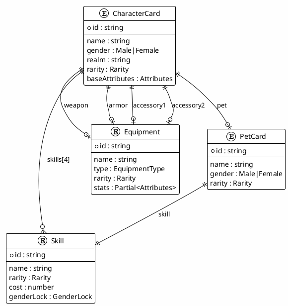
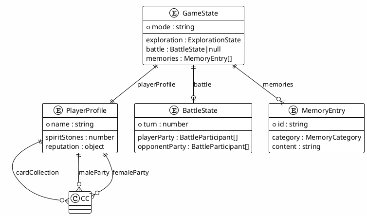

# 仙侠卡牌RPG - 数据模型使用手册

> 📅 生成日期: 2024-12-12
> 🔖 版本: 1.1.0
> 📁 类型定义文件: `types.ts` (1439行), `App.tsx`, `BottomBar.tsx`

---

## 目录

1. [核心实体模型](#1-核心实体模型)
2. [游戏状态模型](#2-游戏状态模型)
3. [战斗系统模型](#3-战斗系统模型)
4. [子系统模型](#4-子系统模型)
5. [配置与设置模型](#5-配置与设置模型)
6. [模型关系图](#6-模型关系图)
7. [UI组件模型](#7-ui组件模型)
8. [AI系统模型](#8-ai系统模型)

---

## 1. 核心实体模型

### 1.1 Attributes - 角色属性

```typescript
interface Attributes {
  hp: number;        // 当前气血
  maxHp: number;     // 最大气血
  mp: number;        // 当前真元
  maxMp: number;     // 最大真元
  attack: number;    // 攻击力
  defense: number;   // 防御力
  speed: number;     // 速度
  critRate: number;  // 暴击率 (0-100)
  critDmg: number;   // 暴击伤害 (百分比，如150表示1.5倍)
}
```

**使用示例**:
```typescript
const baseAttributes: Attributes = {
  hp: 100,
  maxHp: 100,
  mp: 50,
  maxMp: 50,
  attack: 20,
  defense: 10,
  speed: 15,
  critRate: 10,
  critDmg: 150
};
```

**业务规则**:
- ✅ `hp` 不能超过 `maxHp`
- ✅ `mp` 不能超过 `maxMp`
- ✅ `critRate` 范围为 0-100
- ✅ `critDmg` 通常 >= 100（100表示无额外伤害）

---

### 1.2 Skill - 技能

```typescript
interface Skill {
  id: string;                           // 唯一标识
  name: string;                         // 技能名称
  rarity: Rarity;                       // 稀有度
  description: string;                  // 风味描述
  mechanicsDescription: string;         // 机制描述（如"造成120%攻击力伤害"）
  eroticDescription: string;            // 色情化描述
  cost: number;                         // 真元消耗
  genderLock: 'Male' | 'Female' | 'Universal';  // 性别锁定
}
```

**使用示例**:
```typescript
const skill: Skill = {
  id: 'skill-001',
  name: '烈焰斩',
  rarity: '珍品',
  description: '以烈焰之力斩击敌人',
  mechanicsDescription: '造成150%攻击力的火属性伤害',
  eroticDescription: '火焰缠绕剑身...',
  cost: 20,
  genderLock: 'Universal'
};
```

**业务规则**:
- ✅ 角色最多装备4个技能（前2个为固有技能，后2个为学习技能）
- ✅ 学习技能时需检查 `genderLock` 是否匹配
- ⚠️ `cost` 为0表示被动技能或无消耗

---

### 1.3 Equipment - 装备

```typescript
interface Equipment {
  id: string;
  name: string;
  type: 'Weapon' | 'Armor' | 'Accessory';
  rarity: Rarity;
  description: string;
  genderLock?: 'Male' | 'Female' | 'Universal';
  stats: Partial<{
    attack: number;
    hp: number;
    defense: number;
    speed: number;
    critRate: number;
    critDmg: number;
  }>;
}
```

**使用示例**:
```typescript
const equipment: Equipment = {
  id: 'equip-001',
  name: '玄铁剑',
  type: 'Weapon',
  rarity: '优品',
  description: '一把锋利的玄铁剑',
  stats: {
    attack: 15,
    critRate: 5
  }
};
```

**装备槽位**:
| 槽位 | 类型 | 字段名 |
|------|------|--------|
| 武器 | Weapon | `equipment.weapon` |
| 护甲 | Armor | `equipment.armor` |
| 饰品1 | Accessory | `equipment.accessory1` |
| 饰品2 | Accessory | `equipment.accessory2` |

---

### 1.4 CharacterCard - 角色卡牌

```typescript
interface CharacterCard {
  id: string;
  name: string;
  gender: 'Male' | 'Female';
  realm: string;                    // 修炼境界
  rarity: Rarity;
  title: string;                    // 称号
  race: string;                     // 种族
  origin: string;                   // 来历背景
  appearance: string;               // 外观描述
  charm: number;                    // 魅力值 (1-100)
  skillfulness: number;             // 技巧值 (1-100)
  perception: number;               // 悟性值 (1-100)
  baseAttributes: Attributes;
  skills: [Skill | null, Skill | null, Skill | null, Skill | null];
  equipment: {
    weapon: Equipment | null;
    armor: Equipment | null;
    accessory1: Equipment | null;
    accessory2: Equipment | null;
  };
  pet: PetCard | null;
  artUrl?: string;                  // 立绘URL
}
```

**技能槽位说明**:
| 索引 | 类型 | 描述 |
|------|------|------|
| 0 | 固有技能1 | 角色自带，不可更换 |
| 1 | 固有技能2 | 角色自带，不可更换 |
| 2 | 学习技能1 | 可从技能库学习 |
| 3 | 学习技能2 | 可从技能库学习 |

**属性计算公式**:
```typescript
// 最终属性 = 基础属性 + 装备加成
const calculateFinalStats = (card: CharacterCard): Attributes => {
  const base = { ...card.baseAttributes };
  const equips = [
    card.equipment.weapon,
    card.equipment.armor,
    card.equipment.accessory1,
    card.equipment.accessory2
  ].filter(Boolean);
  
  equips.forEach(equip => {
    Object.entries(equip.stats).forEach(([stat, value]) => {
      base[stat] = (base[stat] || 0) + value;
    });
  });
  
  return base;
};
```

---

### 1.5 PetCard - 兽宠卡牌

```typescript
interface PetCard {
  id: string;
  name: string;
  gender: 'Male' | 'Female';
  rarity: Rarity;
  description: string;
  artUrl?: string;
  skill: Skill;                     // 兽宠只有一个技能
}
```

**业务规则**:
- ✅ 每个角色最多携带1只宠物
- ✅ 宠物技能的 `cost` 通常为0
- ✅ 宠物技能的 `genderLock` 通常为 'Universal'

---

## 2. 游戏状态模型

### 2.1 GameState - 游戏全局状态

```typescript
interface GameState {
  mode: 'exploration' | 'battle';
  exploration: ExplorationState;
  playerProfile: PlayerProfile;
  battle: BattleState | null;
  memories: MemoryEntry[];
  smallSummaries: MemorySummary[];
  largeSummaries: MemorySummary[];
  vectorConfig: VectorConfig;
  summarySettings: SummarySettings;
}
```

**状态流转**:
```
初始化 → exploration模式 ⇄ battle模式
                ↓
           模态框交互
```

---

### 2.2 PlayerProfile - 玩家档案

```typescript
interface PlayerProfile {
  name: string;
  title: string;
  spiritStones: number;             // 灵石（货币）
  reputation: {
    level: string;                  // 声望等级
    score: number;                  // 声望分数
  };
  maleParty: CharacterCard[];       // 男性队伍（最多4人）
  femaleParty: CharacterCard[];     // 女性队伍（最多4人）
  cardCollection: CharacterCard[];  // 角色收藏
  petCollection: PetCard[];         // 宠物收藏
  skillLibrary: Skill[];            // 技能库
  equipmentInventory: Equipment[];  // 装备库
  quests: Quest[];                  // 任务列表
  relationships: CharacterRelationship[];  // 人际关系
  businessDistrict?: BusinessDistrict;     // 商业区
}
```

**队伍限制**:
- ✅ 男性队伍最多4人
- ✅ 女性队伍最多4人
- ✅ 战斗时只能选择一个队伍出战

---

### 2.3 ExplorationState - 探索状态

```typescript
interface ExplorationState {
  currentStory: string;             // 当前剧情文本
  choices: string[];                // 可选行动
  location: string;                 // 当前位置
  time: string;                     // 游戏内时间
}
```

---

### 2.4 MemoryEntry - 记忆条目

```typescript
interface MemoryEntry {
  id: string;
  category: MemoryCategory;
  title: string;
  content: string;
  timestamp: string;                // 显示用时间戳
  realTimestamp: number;            // 真实时间戳（毫秒）
  importance: 'low' | 'medium' | 'high';
  vectorId?: string;                // 关联的向量ID
}

type MemoryCategory = 
  | '探索' | '战斗' | '商城' | '医馆' 
  | '悬赏' | '培育' | '商业' | '声望' 
  | '公告' | '大牢' | '其他';
```

**记忆系统流程**:
```
游戏事件 → 创建MemoryEntry → 向量化(可选) → 存储
                                    ↓
                            语义搜索时检索
```

---

### 2.5 MemorySummary - 记忆总结

```typescript
interface MemorySummary {
  id: string;
  type: 'small' | 'large';
  category: MemoryCategory;
  title: string;
  content: string;
  sourceMemoryIds: string[];        // 来源记忆ID列表
  startIndex: number;
  endIndex: number;
  timestamp: string;
  realTimestamp: number;
  vectorId?: string;
}
```

**总结层级**:
| 类型 | 触发条件 | 描述 |
|------|----------|------|
| small | 每N条记忆 | 小范围总结 |
| large | 每M条小总结 | 大范围总结 |

---

## 3. 战斗系统模型

### 3.1 BattleState - 战斗状态

```typescript
interface BattleState {
  playerParty: BattleParticipant[];
  opponentParty: BattleParticipant[];
  currentPlayerIndex: number;
  currentOpponentIndex: number;
  turn: number;
  combatLog: string[];
  isPlayerTurn: boolean;
  lastAction?: {
    actor: string;
    action: string;
    target: string;
    damage?: number;
  };
}
```

---

### 3.2 BattleParticipant - 战斗参与者

```typescript
interface BattleParticipant {
  card: CharacterCard;
  currentHp: number;
  currentMp: number;
  statusEffects: StatusEffect[];
  calculatedStats: Attributes;      // 计算后的最终属性
  isDefeated: boolean;
}
```

**初始化流程**:
```typescript
const initParticipant = (card: CharacterCard): BattleParticipant => ({
  card,
  currentHp: card.baseAttributes.maxHp,
  currentMp: card.baseAttributes.maxMp,
  statusEffects: [],
  calculatedStats: calculateFinalStats(card),
  isDefeated: false
});
```

---

### 3.3 StatusEffect - 状态效果

```typescript
interface StatusEffect {
  name: string;                     // 状态名称
  description: string;              // 风味描述
  mechanicsDescription: string;     // 机制说明（必填！）
  duration: number;                 // 剩余回合数
}
```

**常见状态效果**:
| 名称 | 机制示例 |
|------|----------|
| 中毒 | 每回合损失最大气血的5% |
| 灼烧 | 每回合损失10点气血 |
| 魅惑 | 防御降低30%，持续2回合 |
| 虚弱 | 攻击力降低20%，持续3回合 |
| 护盾 | 吸收50点伤害 |

---

## 4. 子系统模型

### 4.1 PrisonSystem - 监狱系统

```typescript
interface PrisonSystem {
  prisoners: Prisoner[];
  guards: CharacterCard[];
  laborSites: LaborSite[];
  materialInventory: LaborMaterial[];
  eventLog: PrisonEvent[];
}

interface Prisoner {
  character: CharacterCard;         // 囚犯角色卡
  crime: string;                    // 罪行描述
  sentence: number;                 // 刑期（天）
  remainingDays: number;            // 剩余刑期
  submissionLevel: number;          // 屈服度 (0-100)
  loyaltyLevel: number;             // 归顺度 (0-100)
  health: number;                   // 健康度 (0-100)
  sanity: number;                   // 神智 (0-100)
  location: PrisonArea;             // 当前所在区域
  cellType: CellType;               // 牢房类型
  value: {
    ransom: number;                 // 赎金价值
    labor: number;                  // 劳役价值
    intelligence: number;           // 情报价值
  };
  status: PrisonerStatus[];         // 当前状态标签数组
  history: InterrogationRecord[];   // 审讯历史
  knownInformation: string[];       // 已获取情报
  potentialInformation: string[];   // 潜在可获取情报
  imprisonedDate: string;           // 入狱日期（游戏时间）
  realImprisonedTime: number;       // 入狱时间（真实时间戳）
}

type PrisonArea = '居住区' | '审讯区' | '娱乐区' | '劳役区' | '管理区' | '医疗区';
type CellType = '普通牢房' | '重犯牢房' | '单独囚室';
type PrisonerStatus = '健康' | '受伤' | '重伤' | '生病' | '精神失常' | '意志消沉' | '劳役中' | '审讯中';
```

**业务规则**:
- ✅ `submissionLevel` 达到60%且 `loyaltyLevel` 达到80%时可招募
- ✅ `health` 降至0时囚犯死亡
- ✅ `sanity` 降至0时囚犯精神失常
- ⚠️ 劳役中的囚犯 `status` 包含 '劳役中' 标签

---

### 4.2 LaborSite - 劳役场地

```typescript
/**
 * 劳役场地
 * 来源: App.tsx - prisonSystem.laborSites
 */
interface LaborSite {
  id: string;                       // 唯一标识
  type: LaborSiteType;              // 场地类型
  name: string;                     // 场地名称
  description: string;              // 场地描述
  maxWorkers: number;               // 最大工人数量
  workers: LaborWorker[];           // 当前工人列表
}

type LaborSiteType = '矿山' | '采药';

/**
 * 劳役工人
 * 来源: App.tsx - handleAssignLabor
 */
interface LaborWorker {
  prisonerId: string;               // 囚犯ID
  prisonerName: string;             // 囚犯名称（便于显示）
  startTime: number;                // 开始时间戳
  endTime: number;                  // 结束时间戳
  duration: number;                 // 劳役时长（小时）
  status: 'working' | 'completed';  // 劳役状态
}
```

**劳役场地初始化示例**:
```typescript
const initialLaborSites: LaborSite[] = [
  {
    id: 'mine-01',
    type: '矿山',
    name: '青蛇矿脉',
    description: '宗门后山的灵石矿脉',
    maxWorkers: 2,
    workers: []
  },
  {
    id: 'herb-01',
    type: '采药',
    name: '灵药园',
    description: '宗门的药材种植园',
    maxWorkers: 2,
    workers: []
  }
];
```

---

### 4.3 EtiquetteSystem - 礼仪系统

```typescript
interface EtiquetteSystem {
  designer: EtiquetteDesigner | null;
  languageEtiquettes: LanguageEtiquette[];
  behaviorDressEtiquettes: BehaviorDressEtiquette[];
  weeklyThemes: WeeklyTheme[];
  currentTheme: WeeklyTheme | null;
  designerWorkbench: DesignerWorkbench | null;
  settings: EtiquetteSettings;
  logs: EtiquetteLogEntry[];
  stats: {
    totalGenerated: number;
    totalActive: number;
    totalExecutions: number;
    cycleCount: number;
  };
}
```

**礼仪场景映射**:
```typescript
const SCENE_TO_SHOP_TYPE = {
  brothel: '青楼',
  arena: '角斗场',
  alchemy: '炼丹房',
  auction: '拍卖行',
  intelligence: '情报阁',
  hospital: '医馆',
  prison: '大牢',
  etiquette_hall: '礼仪馆',
  general: null
};
```

---

### 4.4 BountyTarget - 悬赏目标

```typescript
interface BountyTarget {
  id: string;
  name: string;                     // 悬赏称号
  specialTrait: string;             // 特殊体质/能力描述
  locationHint: string;             // 位置线索
  character: CharacterCard;         // 目标角色数据
  status: '悬赏中' | '追踪中' | '已完成';
  trackerId: string | null;         // 追踪者ID
  startTime: number;
  endTime: number;
  trackingLog: string | null;       // 追踪日志
  finalOutcome: string | null;      // 最终结果
}
```

---

### 4.5 MedicalRecord - 病历记录

```typescript
interface MedicalRecord {
  patientId: string;
  name: string;
  gender: 'Male' | 'Female';
  age: number;
  background: string;
  genitalShape: string;             // 生殖器形态描述
  sexualFeatures: string[];         // 性特征列表
  illnessDescription: string;       // 病症描述
}
```

---

## 5. 配置与设置模型

### 5.1 VectorConfig - 向量配置

```typescript
interface VectorConfig {
  // 基础配置
  enabled: boolean;
  apiUrl: string;
  apiKey: string;
  model: string;
  
  // 自动化配置
  autoVectorize: boolean;
  vectorizeOnSummary: boolean;
  batchSize: number;
  
  // 搜索配置
  similarityThreshold: number;      // 相似度阈值 (0-1)
  maxResults: number;
  topKBeforeRerank: number;
  
  // 重排序配置
  rerankerEnabled: boolean;
  rerankerApiUrl: string;
  rerankerApiKey: string;
  rerankerModel: string;
  
  // 其他
  retryAttempts: number;
  cacheEnabled: boolean;
}
```

**默认值**:
```typescript
const defaultVectorConfig: VectorConfig = {
  enabled: false,
  apiUrl: 'https://api.openai.com/v1',
  apiKey: '',
  model: 'text-embedding-3-small',
  autoVectorize: false,
  vectorizeOnSummary: true,
  batchSize: 10,
  similarityThreshold: 0.7,
  maxResults: 20,
  topKBeforeRerank: 50,
  rerankerEnabled: false,
  rerankerApiUrl: 'https://api.jina.ai/v1',
  rerankerApiKey: '',
  rerankerModel: 'jina-reranker-v2-base-multilingual',
  retryAttempts: 3,
  cacheEnabled: true
};
```

---

### 5.2 EtiquetteSettings - 礼仪设置

```typescript
interface EtiquetteSettings {
  autoRefreshEnabled: boolean;
  refreshIntervalDays: number;
  lastRefreshTime: number;
  
  languageEtiquetteCount: number;
  behaviorDressEtiquetteCount: number;
  
  enabledScenes: EtiquetteScene[];
  
  languageAspects: {
    addressing: boolean;            // 称呼用语
    requesting: boolean;            // 请求/汇报用语
    thanking: boolean;              // 感谢/道歉用语
  };
  
  behaviorAspects: {
    upperDress: boolean;
    lowerDress: boolean;
    accessories: boolean;
    entryEtiquette: boolean;
    servicePosture: boolean;
    specialActions: boolean;
  };
  
  styleSettings: {
    shameLevel: number;             // 羞耻程度 (0-100)
    submissionLevel: number;        // 服从强度 (0-100)
    exposureLevel: number;          // 露出程度 (0-100)
  };
  
  autoDistribute: boolean;
  autoDeprecateOld: boolean;
  keepTopExecuted: number;
}
```

---

## 6. 模型关系图

### 6.1 核心实体关系



### 6.2 游戏状态关系



---

## 7. UI组件模型

### 7.1 NavButton - 导航按钮

```typescript
/**
 * 底部导航按钮配置
 * 来源: BottomBar.tsx
 */
interface NavButton {
  label: string;                    // 按钮标签文字
  icon: string;                     // Font Awesome 图标类名
  onClick: () => void;              // 点击事件处理函数
  color?: string;                   // 可选的颜色类（如 'text-pink-400'）
  badge?: number;                   // 可选的徽章数字（未读/待处理数量）
}
```

**使用示例**:
```typescript
const primaryActions: NavButton[] = [
  { label: '探索', icon: 'fa-solid fa-map-location-dot', onClick: onMapClick },
  { label: '队伍', icon: 'fa-solid fa-users', onClick: () => onNavClick('队伍') },
  { label: '背包', icon: 'fa-solid fa-briefcase', onClick: () => onNavClick('背包') },
  { label: '活动', icon: 'fa-solid fa-trophy', onClick: () => onNavClick('竞技场'),
    badge: gameState.playerProfile.quests.filter(q => q.status === 'In Progress').length },
  { label: '更多', icon: 'fa-solid fa-ellipsis-vertical', onClick: () => setShowMoreMenu(!showMoreMenu) },
];
```

---

### 7.2 BottomBarProps - 底部栏属性

```typescript
/**
 * BottomBar 组件属性接口
 * 来源: BottomBar.tsx
 */
interface BottomBarProps {
  gameState: GameState;                     // 完整游戏状态
  isLoading: boolean;                       // 加载状态
  error: string | null;                     // 错误信息
  onExplorationAction: (action: string) => void;  // 探索行动处理
  onNavClick: (modal: ModalType) => void;   // 模态框导航
  onMapClick: () => void;                   // 打开地图
  onInteractClick: () => void;              // 打开互动面板
  onTelepathyClick: () => void;             // 打开传音面板
  onSystemClick: () => void;                // 打开系统菜单
  onQuestClick: () => void;                 // 打开任务日志
  onBusinessClick: () => void;              // 打开产业面板
  onNextDay: () => void;                    // 日结算
  onHospitalClick: () => void;              // 打开医馆
  onBountyBoardClick: () => void;           // 打开红尘录
  onAnnouncementsClick: () => void;         // 打开江湖传闻
  onCultivationClick: () => void;           // 打开育灵轩
  onMemoryClick: () => void;                // 打开记忆面板
  onCharacterStatusClick: () => void;       // 打开人物状态
  onPrisonClick: () => void;                // 打开镇狱大牢
  onEtiquetteHallClick: () => void;         // 打开礼仪设计馆
}
```

---

### 7.3 功能模块层级映射

| 层级 | 功能名称 | 触发回调 | 图标 |
|------|----------|----------|------|
| **一级** | 探索 | `onMapClick` | `fa-map-location-dot` |
| **一级** | 队伍 | `onNavClick('队伍')` | `fa-users` |
| **一级** | 背包 | `onNavClick('背包')` | `fa-briefcase` |
| **一级** | 活动 | `onNavClick('竞技场')` | `fa-trophy` |
| **一级** | 更多 | `setShowMoreMenu` | `fa-ellipsis-vertical` |
| **二级** | 商城 | `onNavClick('商城')` | `fa-store` |
| **二级** | 任务 | `onQuestClick` | `fa-scroll` |
| **二级** | 记忆 | `onMemoryClick` | `fa-book-open` |
| **二级** | 传音 | `onTelepathyClick` | `fa-om` |
| **二级** | 育灵轩 | `onCultivationClick` | `fa-dna` |
| **二级** | 产业 | `onBusinessClick` | `fa-building` |
| **二级** | 医馆 | `onHospitalClick` | `fa-hospital` |
| **二级** | 红尘录 | `onBountyBoardClick` | `fa-book-skull` |
| **二级** | 镇狱大牢 | `onPrisonClick` | `fa-dungeon` |
| **二级** | 礼仪设计馆 | `onEtiquetteHallClick` | `fa-ribbon` |
| **二级** | 江湖传闻 | `onAnnouncementsClick` | `fa-bullhorn` |
| **二级** | 人物状态 | `onCharacterStatusClick` | `fa-users-viewfinder` |
| **二级** | 系统 | `onSystemClick` | `fa-bars` |

---

## 8. AI系统模型

### 8.1 AI消息捕获服务

```typescript
/**
 * AI消息捕获服务接口
 * 来源: services/aiMessageCapture.ts
 *
 * 用于自动捕获SillyTavern中AI生成的消息并保存到记忆系统
 */
interface AIMessageCaptureService {
  // 设置消息接收回调
  setMessageCallback: (
    callback: (message: CapturedMessage, category: MemoryCategory) => void
  ) => void;
  
  // 设置当前场景（用于自动分类）
  setCurrentScene: (scene: SceneType) => void;
  
  // 注册SillyTavern事件监听器
  registerEventListeners: () => void;
  
  // 手动捕获消息
  captureMessage: (content: string, category?: MemoryCategory) => void;
  
  // 清理资源
  cleanup: () => void;
}

interface CapturedMessage {
  id: string;                       // 唯一ID
  content: string;                  // 消息内容
  timestamp: number;                // 捕获时间戳
  scene: SceneType;                 // 捕获时的场景
  source: 'ai' | 'system';          // 消息来源
}

type SceneType =
  | 'exploration'    // 探索
  | 'battle'         // 战斗
  | 'consultation'   // 医馆问诊
  | 'hospital'       // 医馆
  | 'surveillance'   // 商业监控
  | 'business'       // 商业
  | 'bounty'         // 悬赏
  | 'cultivation'    // 培育
  | 'map'            // 地图
  | 'interaction'    // 互动
  | 'telepathy'      // 传音
  | 'reputation'     // 声望
  | 'announcement'   // 公告
  | 'arena'          // 竞技场
  | 'shop';          // 商城
```

**场景到记忆分类的映射**:
```typescript
const SCENE_TO_CATEGORY: Record<SceneType, MemoryCategory> = {
  exploration: '探索',
  battle: '战斗',
  consultation: '医馆',
  hospital: '医馆',
  surveillance: '商业',
  business: '商业',
  bounty: '悬赏',
  cultivation: '培育',
  map: '探索',
  interaction: '其他',
  telepathy: '其他',
  reputation: '声望',
  announcement: '公告',
  arena: '战斗',
  shop: '商城'
};
```

---

### 8.2 AI消息捕获初始化流程

```typescript
/**
 * App组件中的AI消息捕获初始化
 * 来源: App.tsx - useEffect
 */
useEffect(() => {
  // 设置消息接收回调，自动保存到记忆系统
  aiMessageCapture.setMessageCallback((message, category) => {
    const title = message.content.length > 30
      ? message.content.substring(0, 30) + '...'
      : message.content;
    
    addMemory(
      category,
      `AI生成: ${title}`,
      message.content,
      [] // 可从content中提取涉及的角色
    );
  });
  
  // 尝试注册SillyTavern事件监听器
  try {
    aiMessageCapture.registerEventListeners();
  } catch (error) {
    console.warn('AI消息捕获服务初始化失败（可能不在SillyTavern环境中）');
  }
  
  // 清理函数
  return () => {
    aiMessageCapture.cleanup();
  };
}, []);
```

---

### 8.3 场景切换同步

```typescript
/**
 * 根据当前模态框状态更新AI捕获场景
 * 来源: App.tsx - useEffect
 */
useEffect(() => {
  if (consultationPatient) {
    aiMessageCapture.setCurrentScene('consultation');
  } else if (isHospitalModalOpen) {
    aiMessageCapture.setCurrentScene('hospital');
  } else if (surveillanceTarget) {
    aiMessageCapture.setCurrentScene('surveillance');
  } else if (isBusinessModalOpen) {
    aiMessageCapture.setCurrentScene('business');
  } else if (isBountyBoardOpen) {
    aiMessageCapture.setCurrentScene('bounty');
  } else if (isCultivationModalOpen) {
    aiMessageCapture.setCurrentScene('cultivation');
  } else if (isMapOpen) {
    aiMessageCapture.setCurrentScene('map');
  } else if (isInteractionModalOpen) {
    aiMessageCapture.setCurrentScene('interaction');
  } else if (isTelepathyModalOpen) {
    aiMessageCapture.setCurrentScene('telepathy');
  } else if (isReputationModalOpen) {
    aiMessageCapture.setCurrentScene('reputation');
  } else if (isAnnouncementModalOpen) {
    aiMessageCapture.setCurrentScene('announcement');
  } else if (activeModal === '竞技场') {
    aiMessageCapture.setCurrentScene('arena');
  } else if (activeModal === '商城') {
    aiMessageCapture.setCurrentScene('shop');
  } else if (gameState.mode === 'exploration') {
    aiMessageCapture.setCurrentScene('exploration');
  }
}, [/* 所有相关模态框状态 */]);
```

---

> 📝 **文档说明**: 本手册详细描述了仙侠卡牌RPG的所有数据模型，包括实体定义、字段说明、业务规则和模型关系。开发时请严格遵循这些模型定义以确保数据一致性。

> 🔄 **版本 1.1.0 更新**:
> - 完善 Prisoner 接口定义，添加归顺度、神智等字段
> - 添加 PrisonerStatus 枚举完整定义
> - 添加 LaborWorker 接口及劳役场地初始化示例
> - 新增第7章：UI组件模型（NavButton、BottomBarProps、功能模块层级映射）
> - 新增第8章：AI系统模型（消息捕获服务、场景类型、初始化流程、场景切换同步）