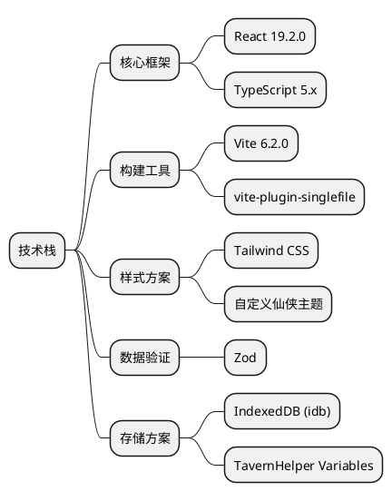
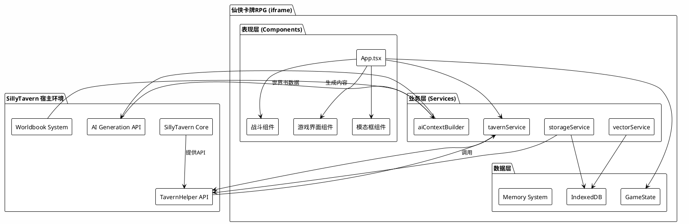
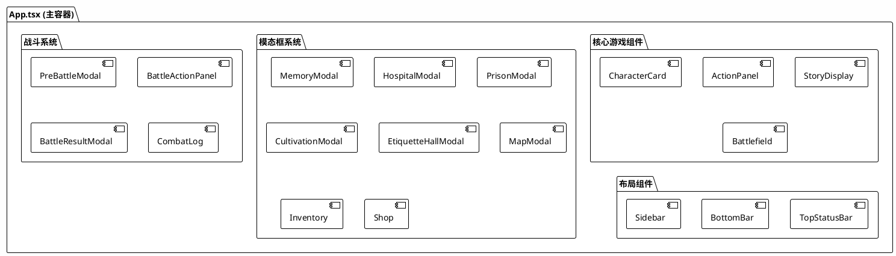
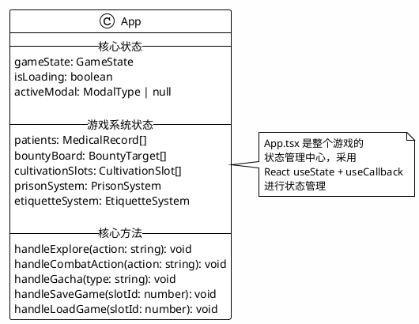
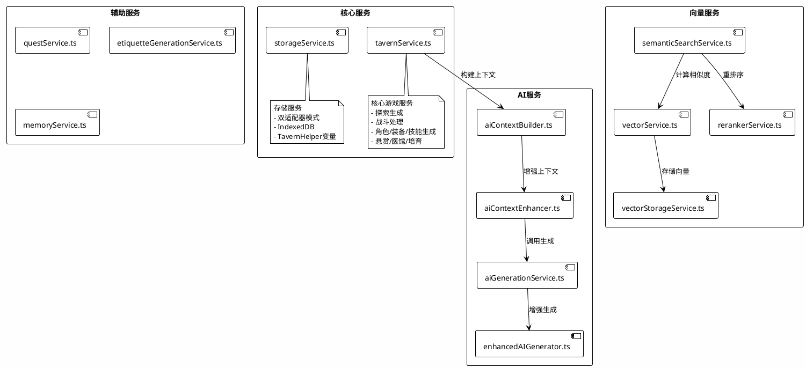
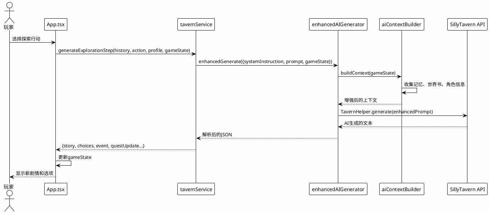
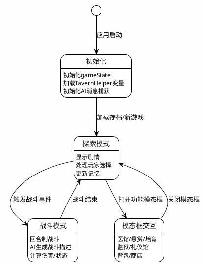
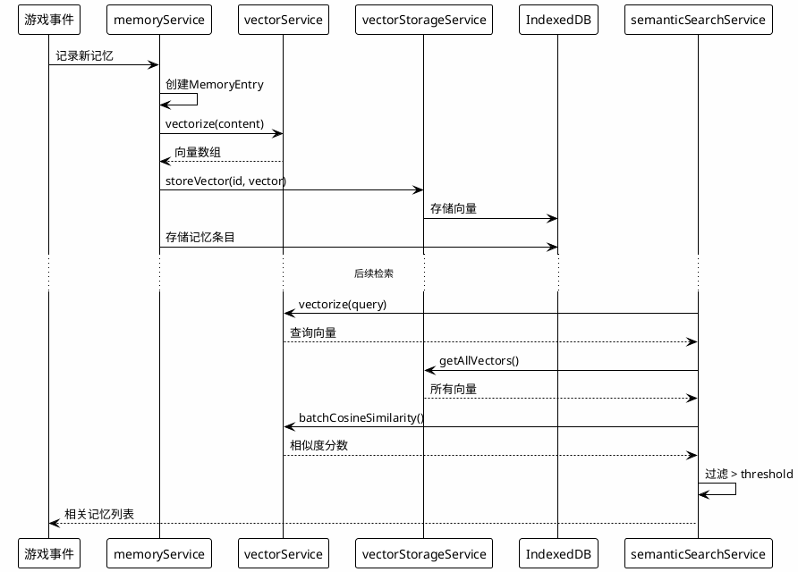
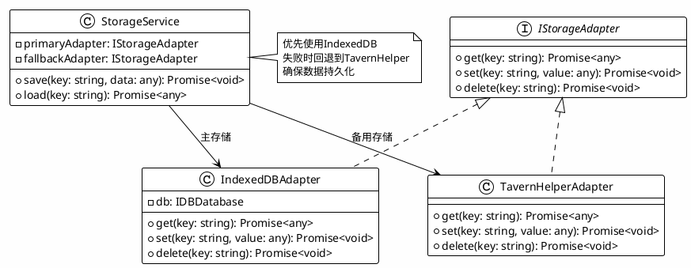
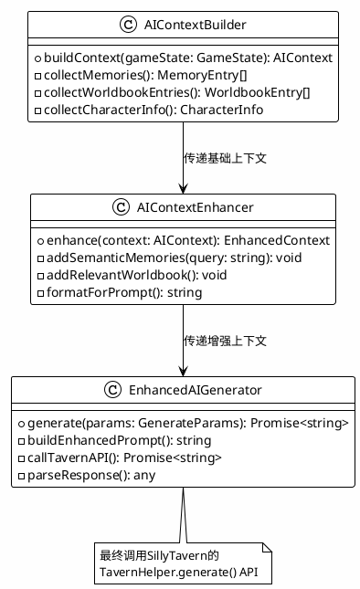

# 仙侠卡牌RPG - 系统架构分析文档

> 📅 生成日期: 2024-12-12
> 🔖 版本: 1.0.0
> 📁 项目路径: xianxia-card-rpg

---

## 目录

1. [项目概述](#1-项目概述)
2. [技术栈全景](#2-技术栈全景)
3. [系统架构图](#3-系统架构图)
4. [核心模块分析](#4-核心模块分析)
5. [数据流分析](#5-数据流分析)
6. [关键设计模式](#6-关键设计模式)

---

## 1. 项目概述

### 1.1 项目定位

**仙侠卡牌RPG** 是一款基于 SillyTavern 平台的 iframe 嵌入式游戏扩展，融合了：
- 🎴 卡牌收集与养成系统
- ⚔️ 回合制战斗系统
- 🗺️ 探索与剧情系统
- 🤖 AI 驱动的动态内容生成
- 🧠 向量记忆与语义搜索系统

### 1.2 核心特性

| 特性 | 描述 |
|------|------|
| **AI 深度集成** | 与 SillyTavern 的 AI 生成系统深度集成，支持动态剧情、战斗描述、角色生成 |
| **向量记忆系统** | 基于 Embedding API 的语义搜索，支持上下文感知的记忆检索 |
| **双适配器存储** | 同时支持 IndexedDB 和 TavernHelper 变量存储 |
| **响应式设计** | 完整的移动端适配，支持触摸手势 |
| **模块化架构** | 清晰的组件、服务、类型分层 |

### 1.3 项目结构概览

```
xianxia-card-rpg/
├── App.tsx                 # 主应用组件 (3173行)
├── index.tsx               # 应用入口
├── types.ts                # 核心类型定义 (1439行)
├── constants.ts            # 常量与初始数据 (629行)
├── locations.ts            # 地图位置数据
├── components/             # UI组件 (70+个)
├── services/               # 业务服务 (28个)
├── hooks/                  # React Hooks (4个)
├── types/                  # 扩展类型定义
├── @types/                 # SillyTavern API 类型
└── docs/                   # 文档目录
```

---

## 2. 技术栈全景

### 2.1 前端框架



### 2.2 依赖清单

| 依赖 | 版本 | 用途 |
|------|------|------|
| `react` | 19.2.0 | UI 框架 |
| `react-dom` | 19.2.0 | DOM 渲染 |
| `idb` | ^8.0.3 | IndexedDB 封装 |
| `zod` | ^3.24.4 | 运行时类型验证 |
| `vite` | 6.2.0 | 构建工具 |
| `tailwindcss` | ^4.1.4 | CSS 框架 |
| `typescript` | ~5.7.2 | 类型系统 |

### 2.3 构建配置

```typescript
// vite.config.ts 关键配置
export default defineConfig({
  plugins: [
    react(),
    viteSingleFile()  // 打包为单文件，便于 iframe 嵌入
  ],
  build: {
    target: 'esnext',
    cssCodeSplit: false,
    assetsInlineLimit: 100000000
  }
});
```

---

## 3. 系统架构图

### 3.1 整体架构



### 3.2 组件层次结构



---

## 4. 核心模块分析

### 4.1 入口点分析

#### 4.1.1 index.tsx - 应用入口

```typescript
// index.tsx (17行)
import React from 'react';
import ReactDOM from 'react-dom/client';
import App from './App';

const root = ReactDOM.createRoot(
  document.getElementById('root') as HTMLElement
);

root.render(
  <React.StrictMode>
    <App />
  </React.StrictMode>
);
```

**✅ 设计要点**:
- 使用 React 18+ 的 `createRoot` API
- 启用 StrictMode 进行开发时检查
- 单一入口，简洁明了

#### 4.1.2 App.tsx - 主应用组件

**文件规模**: 3173 行
**核心职责**: 游戏状态管理、模态框控制、事件处理



**关键状态变量**:

| 状态 | 类型 | 描述 |
|------|------|------|
| `gameState` | `GameState` | 核心游戏状态 |
| `isLoading` | `boolean` | 加载状态 |
| `activeModal` | `ModalType \| null` | 当前激活的模态框 |
| `patients` | `MedicalRecord[]` | 医馆病人列表 |
| `bountyBoard` | `BountyTarget[]` | 悬赏榜单 |
| `cultivationSlots` | `CultivationSlot[]` | 培育槽位 |
| `prisonSystem` | `PrisonSystem` | 监狱系统状态 |
| `etiquetteSystem` | `EtiquetteSystem` | 礼仪系统状态 |

### 4.2 服务层架构



### 4.3 服务详细分析

#### 4.3.1 tavernService.ts - 核心游戏服务

**文件规模**: 1959 行
**核心职责**: 所有与 AI 生成相关的游戏逻辑

**主要函数**:

| 函数名 | 行数 | 功能 |
|--------|------|------|
| `generateExplorationStep` | 80-126 | 生成探索步骤 |
| `processCombatTurn` | 128-255 | 处理战斗回合 |
| `generateRandomCharacter` | 284-349 | 生成随机角色 |
| `generateRandomEquipment` | 351-380 | 生成随机装备 |
| `generateRandomSkill` | 382-416 | 生成随机技能 |
| `generatePatient` | 869-929 | 生成医馆病人 |
| `generateBountyTarget` | 935-1078 | 生成悬赏目标 |
| `generateLaborResult` | 1843-1959 | 生成劳役结果 |

**调用链路示例 - 探索生成**:



#### 4.3.2 vectorService.ts - 向量化服务

**文件规模**: 340 行
**核心职责**: 文本向量化与相似度计算

```typescript
// 核心类结构
class VectorService {
  private config: VectorConfig;
  
  // 配置管理
  updateConfig(config: VectorConfig): void;
  getConfig(): VectorConfig;
  
  // API交互
  testConnection(): Promise<{success, error?, model?}>;
  fetchAvailableModels(): Promise<{success, models?, error?}>;
  
  // 向量化
  vectorize(text: string): Promise<number[]>;
  batchVectorize(texts: string[]): Promise<number[][]>;
  
  // 相似度计算
  cosineSimilarity(vecA: number[], vecB: number[]): number;
  batchCosineSimilarity(queryVector: number[], vectors: number[][]): number[];
}
```

**默认配置**:

```typescript
const defaultVectorConfig: VectorConfig = {
  enabled: false,
  apiUrl: 'https://api.openai.com/v1',
  apiKey: '',
  model: 'text-embedding-3-small',
  
  autoVectorize: false,
  vectorizeOnSummary: true,
  batchSize: 10,
  
  similarityThreshold: 0.7,
  maxResults: 20,
  topKBeforeRerank: 50,
  
  rerankerEnabled: false,
  rerankerApiUrl: 'https://api.jina.ai/v1',
  rerankerModel: 'jina-reranker-v2-base-multilingual',
  
  retryAttempts: 3,
  cacheEnabled: true
};
```

---

## 5. 数据流分析

### 5.1 状态管理流程



### 5.2 记忆系统数据流



---

## 6. 关键设计模式

### 6.1 双适配器存储模式



### 6.2 AI上下文增强模式



### 6.3 模态框管理模式

```typescript
// App.tsx 中的模态框管理
type ModalType = 
  | 'inventory' | 'shop' | 'arena' | 'memory'
  | 'hospital' | 'bounty' | 'cultivation' | 'prison'
  | 'etiquette' | 'map' | 'quest' | 'reputation'
  | 'save' | 'announcement' | 'telepathy' | 'business';

// 状态管理
const [activeModal, setActiveModal] = useState<ModalType | null>(null);

// 打开模态框
const openModal = (modal: ModalType) => setActiveModal(modal);

// 关闭模态框
const closeModal = () => setActiveModal(null);

// 条件渲染
{activeModal === 'hospital' && (
  <HospitalModal
    isOpen={true}
    onClose={closeModal}
    {...hospitalProps}
  />
)}
```

---

> 📝 **文档说明**: 本文档为系统架构分析的第一部分，包含项目概述、技术栈、架构图和核心模块分析。后续文档将包含专业术语词汇表、数据模型手册、业务逻辑公式手册和开发实践指南。