# 仙侠卡牌RPG - 系统架构分析文档

> 📅 生成日期: 2024-12-12
> 📅 更新日期: 2024-12-13
> 🔖 版本: 1.1.0
> 📁 项目路径: xianxia-card-rpg

---

## 目录

1. [项目概述](#1-项目概述)
2. [技术栈全景](#2-技术栈全景)
3. [系统架构图](#3-系统架构图)
4. [核心模块分析](#4-核心模块分析)
5. [数据流分析](#5-数据流分析)
6. [关键设计模式](#6-关键设计模式)
7. [核心业务流程时序图](#7-核心业务流程时序图)

---

## 1. 项目概述

### 1.1 项目定位

**仙侠卡牌RPG** 是一款基于 SillyTavern 平台的 iframe 嵌入式游戏扩展，融合了：
- 🎴 卡牌收集与养成系统
- ⚔️ 回合制战斗系统
- 🗺️ 探索与剧情系统
- 🤖 AI 驱动的动态内容生成
- 🧠 向量记忆与语义搜索系统

### 1.2 核心特性

| 特性 | 描述 |
|------|------|
| **AI 深度集成** | 与 SillyTavern 的 AI 生成系统深度集成，支持动态剧情、战斗描述、角色生成 |
| **向量记忆系统** | 基于 Embedding API 的语义搜索，支持上下文感知的记忆检索 |
| **双适配器存储** | 同时支持 IndexedDB 和 TavernHelper 变量存储 |
| **响应式设计** | 完整的移动端适配，支持触摸手势 |
| **模块化架构** | 清晰的组件、服务、类型分层 |

### 1.3 项目结构概览

```
xianxia-card-rpg/
├── App.tsx                 # 主应用组件 (3173行)
├── index.tsx               # 应用入口
├── types.ts                # 核心类型定义 (1439行)
├── constants.ts            # 常量与初始数据 (629行)
├── locations.ts            # 地图位置数据
├── components/             # UI组件 (70+个)
├── services/               # 业务服务 (28个)
├── hooks/                  # React Hooks (4个)
├── types/                  # 扩展类型定义
├── @types/                 # SillyTavern API 类型
└── docs/                   # 文档目录
```

---

## 2. 技术栈全景

### 2.1 前端框架

```plantuml
@startmindmap
* 技术栈
** 核心框架
*** React 19.2.0
*** TypeScript 5.x
** 构建工具
*** Vite 6.2.0
*** vite-plugin-singlefile
** 样式方案
*** Tailwind CSS
*** 自定义仙侠主题
** 数据验证
*** Zod
** 存储方案
*** IndexedDB (idb)
*** TavernHelper Variables
@endmindmap
```

### 2.2 依赖清单

| 依赖 | 版本 | 用途 |
|------|------|------|
| `react` | 19.2.0 | UI 框架 |
| `react-dom` | 19.2.0 | DOM 渲染 |
| `idb` | ^8.0.3 | IndexedDB 封装 |
| `zod` | ^3.24.4 | 运行时类型验证 |
| `vite` | 6.2.0 | 构建工具 |
| `tailwindcss` | ^4.1.4 | CSS 框架 |
| `typescript` | ~5.7.2 | 类型系统 |

### 2.3 构建配置

```typescript
// vite.config.ts 关键配置
export default defineConfig({
  plugins: [
    react(),
    viteSingleFile()  // 打包为单文件，便于 iframe 嵌入
  ],
  build: {
    target: 'esnext',
    cssCodeSplit: false,
    assetsInlineLimit: 100000000
  }
});
```

---

## 3. 系统架构图

### 3.1 整体架构

```plantuml
@startuml
!theme plain
skinparam backgroundColor #FEFEFE
skinparam componentStyle rectangle

package "SillyTavern 宿主环境" {
  [SillyTavern Core] as ST
  [TavernHelper API] as TH
  [AI Generation API] as AI
  [Worldbook System] as WB
}

package "仙侠卡牌RPG (iframe)" {
  package "表现层 (Components)" {
    [App.tsx] as App
    [游戏界面组件] as GameUI
    [模态框组件] as Modals
    [战斗组件] as Battle
  }
  
  package "业务层 (Services)" {
    [tavernService] as TS
    [aiContextBuilder] as ACB
    [vectorService] as VS
    [storageService] as SS
  }
  
  package "数据层" {
    [GameState] as GS
    [IndexedDB] as IDB
    [Memory System] as MS
  }
}

ST --> TH : 提供API
TH --> TS : 调用
AI --> ACB : 生成内容
WB --> ACB : 世界书数据

App --> GameUI
App --> Modals
App --> Battle
App --> TS
App --> GS

TS --> TH
ACB --> AI
VS --> IDB
SS --> IDB
SS --> TH

@enduml
```

### 3.2 组件层次结构

```plantuml
@startuml
!theme plain
skinparam backgroundColor #FEFEFE

package "App.tsx (主容器)" {
  
  package "布局组件" {
    [TopStatusBar] as TSB
    [BottomBar] as BB
    [Sidebar] as SB
  }
  
  package "核心游戏组件" {
    [StoryDisplay] as SD
    [ActionPanel] as AP
    [Battlefield] as BF
    [CharacterCard] as CC
  }
  
  package "模态框系统" {
    [MemoryModal] as MM
    [HospitalModal] as HM
    [PrisonModal] as PM
    [CultivationModal] as CM
    [EtiquetteHallModal] as EHM
    [MapModal] as MapM
    [Inventory] as Inv
    [Shop] as Shop
  }
  
  package "战斗系统" {
    [PreBattleModal] as PBM
    [BattleActionPanel] as BAP
    [BattleResultModal] as BRM
    [CombatLog] as CL
  }
}

TSB -[hidden]-> SD
SD -[hidden]-> BF
BF -[hidden]-> BB

@enduml
```

---

## 4. 核心模块分析

### 4.1 入口点分析

#### 4.1.1 index.tsx - 应用入口

```typescript
// index.tsx (17行)
import React from 'react';
import ReactDOM from 'react-dom/client';
import App from './App';

const root = ReactDOM.createRoot(
  document.getElementById('root') as HTMLElement
);

root.render(
  <React.StrictMode>
    <App />
  </React.StrictMode>
);
```

**✅ 设计要点**:
- 使用 React 18+ 的 `createRoot` API
- 启用 StrictMode 进行开发时检查
- 单一入口，简洁明了

#### 4.1.2 App.tsx - 主应用组件

**文件规模**: 3173 行
**核心职责**: 游戏状态管理、模态框控制、事件处理

```plantuml
@startuml
!theme plain
skinparam backgroundColor #FEFEFE

class App {
  -- 核心状态 --
  gameState: GameState
  isLoading: boolean
  activeModal: ModalType | null
  
  -- 游戏系统状态 --
  patients: MedicalRecord[]
  bountyBoard: BountyTarget[]
  cultivationSlots: CultivationSlot[]
  prisonSystem: PrisonSystem
  etiquetteSystem: EtiquetteSystem
  
  -- 核心方法 --
  handleExplore(action: string): void
  handleCombatAction(action: string): void
  handleGacha(type: string): void
  handleSaveGame(slotId: number): void
  handleLoadGame(slotId: number): void
}

note right of App
  App.tsx 是整个游戏的
  状态管理中心，采用
  React useState + useCallback
  进行状态管理
end note

@enduml
```

**关键状态变量**:

| 状态 | 类型 | 描述 |
|------|------|------|
| `gameState` | `GameState` | 核心游戏状态 |
| `isLoading` | `boolean` | 加载状态 |
| `activeModal` | `ModalType \| null` | 当前激活的模态框 |
| `patients` | `MedicalRecord[]` | 医馆病人列表 |
| `bountyBoard` | `BountyTarget[]` | 悬赏榜单 |
| `cultivationSlots` | `CultivationSlot[]` | 培育槽位 |
| `prisonSystem` | `PrisonSystem` | 监狱系统状态 |
| `etiquetteSystem` | `EtiquetteSystem` | 礼仪系统状态 |

### 4.2 服务层架构

```plantuml
@startuml
!theme plain
skinparam backgroundColor #FEFEFE
skinparam packageStyle rectangle

package "核心服务" {
  [tavernService.ts] as TS
  note bottom of TS
    核心游戏服务
    - 探索生成
    - 战斗处理
    - 角色/装备/技能生成
    - 悬赏/医馆/培育
  end note
  
  [storageService.ts] as SS
  note bottom of SS
    存储服务
    - 双适配器模式
    - IndexedDB
    - TavernHelper变量
  end note
}

package "AI服务" {
  [aiContextBuilder.ts] as ACB
  [aiContextEnhancer.ts] as ACE
  [aiGenerationService.ts] as AGS
  [enhancedAIGenerator.ts] as EAG
}

package "向量服务" {
  [vectorService.ts] as VS
  [vectorStorageService.ts] as VSS
  [semanticSearchService.ts] as SSS
  [rerankerService.ts] as RS
}

package "辅助服务" {
  [questService.ts] as QS
  [etiquetteGenerationService.ts] as EGS
  [memoryService.ts] as MS
}

TS --> ACB : 构建上下文
ACB --> ACE : 增强上下文
ACE --> AGS : 调用生成
AGS --> EAG : 增强生成

VS --> VSS : 存储向量
SSS --> VS : 计算相似度
SSS --> RS : 重排序

@enduml
```

### 4.3 服务详细分析

#### 4.3.1 tavernService.ts - 核心游戏服务

**文件规模**: 1959 行
**核心职责**: 所有与 AI 生成相关的游戏逻辑

**主要函数**:

| 函数名 | 行数 | 功能 |
|--------|------|------|
| `generateExplorationStep` | 80-126 | 生成探索步骤 |
| `processCombatTurn` | 128-255 | 处理战斗回合 |
| `generateRandomCharacter` | 284-349 | 生成随机角色 |
| `generateRandomEquipment` | 351-380 | 生成随机装备 |
| `generateRandomSkill` | 382-416 | 生成随机技能 |
| `generatePatient` | 869-929 | 生成医馆病人 |
| `generateBountyTarget` | 935-1078 | 生成悬赏目标 |
| `generateLaborResult` | 1843-1959 | 生成劳役结果 |

**调用链路示例 - 探索生成**:

```plantuml
@startuml
!theme plain
skinparam backgroundColor #FEFEFE

actor 玩家
participant "App.tsx" as App
participant "tavernService" as TS
participant "enhancedAIGenerator" as EAG
participant "aiContextBuilder" as ACB
participant "SillyTavern API" as ST

玩家 -> App: 选择探索行动
App -> TS: generateExplorationStep(history, action, profile, gameState)
TS -> EAG: enhancedGenerate({systemInstruction, prompt, gameState})
EAG -> ACB: buildContext(gameState)
ACB -> ACB: 收集记忆、世界书、角色信息
ACB --> EAG: 增强后的上下文
EAG -> ST: TavernHelper.generate(enhancedPrompt)
ST --> EAG: AI生成的文本
EAG --> TS: 解析后的JSON
TS --> App: {story, choices, event, questUpdate...}
App -> App: 更新gameState
App --> 玩家: 显示新剧情和选项

@enduml
```

#### 4.3.2 vectorService.ts - 向量化服务

**文件规模**: 340 行
**核心职责**: 文本向量化与相似度计算

```typescript
// 核心类结构
class VectorService {
  private config: VectorConfig;
  
  // 配置管理
  updateConfig(config: VectorConfig): void;
  getConfig(): VectorConfig;
  
  // API交互
  testConnection(): Promise<{success, error?, model?}>;
  fetchAvailableModels(): Promise<{success, models?, error?}>;
  
  // 向量化
  vectorize(text: string): Promise<number[]>;
  batchVectorize(texts: string[]): Promise<number[][]>;
  
  // 相似度计算
  cosineSimilarity(vecA: number[], vecB: number[]): number;
  batchCosineSimilarity(queryVector: number[], vectors: number[][]): number[];
}
```

**默认配置**:

```typescript
const defaultVectorConfig: VectorConfig = {
  enabled: false,
  apiUrl: 'https://api.openai.com/v1',
  apiKey: '',
  model: 'text-embedding-3-small',
  
  autoVectorize: false,
  vectorizeOnSummary: true,
  batchSize: 10,
  
  similarityThreshold: 0.7,
  maxResults: 20,
  topKBeforeRerank: 50,
  
  rerankerEnabled: false,
  rerankerApiUrl: 'https://api.jina.ai/v1',
  rerankerModel: 'jina-reranker-v2-base-multilingual',
  
  retryAttempts: 3,
  cacheEnabled: true
};
```

---

## 5. 数据流分析

### 5.1 状态管理流程

```plantuml
@startuml
!theme plain
skinparam backgroundColor #FEFEFE

state "初始化" as Init
state "探索模式" as Explore
state "战斗模式" as Battle
state "模态框交互" as Modal

[*] --> Init : 应用启动

Init --> Explore : 加载存档/新游戏
Init : 初始化gameState
Init : 加载TavernHelper变量
Init : 初始化AI消息捕获

Explore --> Battle : 触发战斗事件
Explore --> Modal : 打开功能模态框
Explore : 显示剧情
Explore : 处理玩家选择
Explore : 更新记忆

Battle --> Explore : 战斗结束
Battle : 回合制战斗
Battle : AI生成战斗描述
Battle : 计算伤害/状态

Modal --> Explore : 关闭模态框
Modal : 医馆/悬赏/培育
Modal : 监狱/礼仪馆
Modal : 背包/商店

@enduml
```

### 5.2 记忆系统数据流

```plantuml
@startuml
!theme plain
skinparam backgroundColor #FEFEFE

participant "游戏事件" as Event
participant "memoryService" as MS
participant "vectorService" as VS
participant "vectorStorageService" as VSS
participant "IndexedDB" as IDB
participant "semanticSearchService" as SSS

Event -> MS: 记录新记忆
MS -> MS: 创建MemoryEntry
MS -> VS: vectorize(content)
VS --> MS: 向量数组
MS -> VSS: storeVector(id, vector)
VSS -> IDB: 存储向量
MS -> IDB: 存储记忆条目

... 后续检索 ...

SSS -> VS: vectorize(query)
VS --> SSS: 查询向量
SSS -> VSS: getAllVectors()
VSS --> SSS: 所有向量
SSS -> VS: batchCosineSimilarity()
VS --> SSS: 相似度分数
SSS -> SSS: 过滤 > threshold
SSS --> Event: 相关记忆列表

@enduml
```

---

## 6. 关键设计模式

### 6.1 双适配器存储模式

```plantuml
@startuml
!theme plain
skinparam backgroundColor #FEFEFE

interface IStorageAdapter {
  +get(key: string): Promise<any>
  +set(key: string, value: any): Promise<void>
  +delete(key: string): Promise<void>
}

class IndexedDBAdapter implements IStorageAdapter {
  -db: IDBDatabase
  +get(key: string): Promise<any>
  +set(key: string, value: any): Promise<void>
  +delete(key: string): Promise<void>
}

class TavernHelperAdapter implements IStorageAdapter {
  +get(key: string): Promise<any>
  +set(key: string, value: any): Promise<void>
  +delete(key: string): Promise<void>
}

class StorageService {
  -primaryAdapter: IStorageAdapter
  -fallbackAdapter: IStorageAdapter
  +save(key: string, data: any): Promise<void>
  +load(key: string): Promise<any>
}

StorageService --> IndexedDBAdapter : 主存储
StorageService --> TavernHelperAdapter : 备用存储

note right of StorageService
  优先使用IndexedDB
  失败时回退到TavernHelper
  确保数据持久化
end note

@enduml
```

### 6.2 AI上下文增强模式

```plantuml
@startuml
!theme plain
skinparam backgroundColor #FEFEFE

class AIContextBuilder {
  +buildContext(gameState: GameState): AIContext
  -collectMemories(): MemoryEntry[]
  -collectWorldbookEntries(): WorldbookEntry[]
  -collectCharacterInfo(): CharacterInfo
}

class AIContextEnhancer {
  +enhance(context: AIContext): EnhancedContext
  -addSemanticMemories(query: string): void
  -addRelevantWorldbook(): void
  -formatForPrompt(): string
}

class EnhancedAIGenerator {
  +generate(params: GenerateParams): Promise<string>
  -buildEnhancedPrompt(): string
  -callTavernAPI(): Promise<string>
  -parseResponse(): any
}

AIContextBuilder --> AIContextEnhancer : 传递基础上下文
AIContextEnhancer --> EnhancedAIGenerator : 传递增强上下文

note bottom of EnhancedAIGenerator
  最终调用SillyTavern的
  TavernHelper.generate() API
end note

@enduml
```

### 6.3 模态框管理模式

```typescript
// App.tsx 中的模态框管理
type ModalType = 
  | 'inventory' | 'shop' | 'arena' | 'memory'
  | 'hospital' | 'bounty' | 'cultivation' | 'prison'
  | 'etiquette' | 'map' | 'quest' | 'reputation'
  | 'save' | 'announcement' | 'telepathy' | 'business';

// 状态管理
const [activeModal, setActiveModal] = useState<ModalType | null>(null);

// 打开模态框
const openModal = (modal: ModalType) => setActiveModal(modal);

// 关闭模态框
const closeModal = () => setActiveModal(null);

// 条件渲染
{activeModal === 'hospital' && (
  <HospitalModal
    isOpen={true}
    onClose={closeModal}
    {...hospitalProps}
  />
)}
```

---

## 7. 核心业务流程时序图

### 7.1 日结算流程 (handleNextDay)

日结算是游戏中的核心定期事件，处理产业收入和随机事件。

```plantuml
@startuml
!theme plain
skinparam backgroundColor #FEFEFE

actor 玩家
participant "App.tsx" as App
participant "tavernService" as TS
participant "GameState" as GS

玩家 -> App: 点击"下一天"按钮
App -> App: handleNextDay()

group 产业收入计算
    App -> App: calculateBusinessIncome(playerProfile)
    App -> App: 计算商业区每个店铺收入
    note right: 收入 = Σ(店铺等级 × 员工魅力)
end

group 随机商业事件 (30%概率)
    App -> TS: generateBusinessEvent(businessDistrict, cardCollection)
    TS -> TS: 调用AI生成商业事件
    TS --> App: {message, incomeChange}
    App -> App: totalIncome = income + incomeChange
end

group 时间更新
    App -> GS: 更新exploration.time = "第N+1天，清晨"
    App -> GS: 更新spiritStones += totalIncome
    App -> GS: 添加日志到businessDistrict.log
end

group 悬赏刷新 (50%概率)
    App -> TS: generateBountyTarget()
    TS --> App: 新悬赏目标
    App -> GS: 添加到bountyBoard
end

App -> App: 记录商业记忆到memories['商业']
App --> 玩家: 显示结算结果

@enduml
```

### 7.2 悬赏追踪流程

悬赏系统的完整生命周期：接取 → 追踪 → 领取 → 处置。

```plantuml
@startuml
!theme plain
skinparam backgroundColor #FEFEFE

actor 玩家
participant "BountyBoardModal" as BBM
participant "App.tsx" as App
participant "CharacterSelectionModal" as CSM
participant "tavernService" as TS
participant "BountyResultModal" as BRM

== 阶段1：接取悬赏 ==

玩家 -> BBM: 点击"接取"按钮
BBM -> App: onAccept(bountyId)
App -> CSM: 打开角色选择器
note right: 过滤掉busyCharacterIds中的角色
CSM --> 玩家: 显示可用角色列表
玩家 -> CSM: 选择追踪角色
CSM -> App: handleAcceptBounty(bountyId, characterId)

group 计算追踪时间
    App -> App: trackingTime = rarityTimeMap[rarity]
    note right
        凡品: 30分钟
        良品: 1小时
        优品: 2小时
        珍品: 4小时
        ...
        神品: 48小时
    end note
end

App -> App: bounty.status = '追踪中'
App -> App: bounty.trackerId = characterId
App -> App: bounty.startTime / endTime = now / now + trackingTime

== 阶段2：追踪进行中 ==

note over App: 时间流逝 (Date.now() >= endTime)

== 阶段3：领取结果 ==

玩家 -> BBM: 点击"领取"按钮
BBM -> App: handleClaimBounty(bountyId)
App -> TS: generateBountyLog(tracker, target, gameState)
note right: AI生成追捕日志
TS --> App: trackingLog (追捕故事文本)
App -> App: bounty.trackingLog = log
App -> BRM: 打开结果模态框

BRM --> 玩家: 显示追捕日志
玩家 -> BRM: 选择处置方式

alt 选择"击杀"
    BRM -> App: handleBountyOutcome(bountyId, 'killed')
    App -> App: spiritStones += reward × 10
    App -> App: reputation += 5
    App -> App: bounty.status = '已结束'
else 选择"押入大牢"
    BRM -> App: handleBountyOutcome(bountyId, 'imprisoned')
    App -> App: spiritStones += reward × 10
    App -> App: reputation += 20
    App -> App: 创建新Prisoner对象
    App -> App: 添加到prisonSystem.prisoners
    App -> App: bounty.status = '已结束'
end

App -> App: 记录到memories['大牢'或'悬赏']

@enduml
```

### 7.3 育灵轩培育流程

生命培育系统的完整流程。

```plantuml
@startuml
!theme plain
skinparam backgroundColor #FEFEFE

actor 玩家
participant "CultivationModal" as CM
participant "App.tsx" as App
participant "tavernService" as TS
participant "GameState" as GS

== 阶段1：开始培育 ==

玩家 -> CM: 选择培育仓位 (slotId)
CM -> CM: 选择父母A (parentAId)
CM -> CM: 选择父母B (parentBId)
note right: 过滤掉busyCharacterIds

CM -> App: handleStartCultivation(slotId, parentAId, parentBId)

group 计算培育时间
    App -> App: timeA = rarityTimeMap[parentA.rarity]
    App -> App: timeB = rarityTimeMap[parentB.rarity]
    App -> App: cultivationTime = (timeA + timeB) / 2
    note right
        凡品: 1小时
        良品: 2小时
        优品: 4小时
        ...
        神品: 48小时
    end note
end

App -> GS: 更新cultivationPavilion[slotId]
note right
    status = 'Breeding'
    startTime = Date.now()
    endTime = startTime + cultivationTime
    parentA, parentB = 选中的卡牌
end note

== 阶段2：培育进行中 ==

loop 每秒检查 (useEffect interval)
    App -> App: checkCultivationStatus()
    alt Date.now() >= slot.endTime
        App -> GS: slot.status = 'Ready'
        App -> GS: 添加"培育完成"日志
    end
end

== 阶段3：领取结果 ==

玩家 -> CM: 点击"开启灵胎"
CM -> App: handleClaimCultivation(slotId)
App -> TS: generateCultivationResult(parentA, parentB)
note right: AI生成后代卡牌
TS --> App: newCard (CharacterCard 或 PetCard)

alt 是CharacterCard
    App -> GS: cardCollection.push(newCard)
else 是PetCard
    App -> GS: petCollection.push(newCard)
end

App -> GS: 重置slot为Empty状态
App -> App: 记录培育记忆
App --> 玩家: alert("恭喜获得新卡牌: ${newCard.name}")

@enduml
```

### 7.4 囚犯劳役流程

监狱劳役系统的完整流程。

```plantuml
@startuml
!theme plain
skinparam backgroundColor #FEFEFE

actor 玩家
participant "PrisonModal" as PM
participant "App.tsx" as App
participant "tavernService" as TS
participant "GameState" as GS

== 阶段1：分配劳役 ==

玩家 -> PM: 选择囚犯和劳役地点
PM -> App: handleAssignLabor(prisonerId, siteId, duration)

group 验证检查
    App -> App: 查找prisoner和site
    alt site.workers.length >= site.maxWorkers
        App --> 玩家: 提示"工位已满"
    else prisoner.status包含'劳役中'
        App --> 玩家: 提示"囚犯已在劳役中"
    end
end

App -> GS: 创建LaborWorker记录
note right
    prisonerId, prisonerName
    startTime = Date.now()
    endTime = startTime + duration × 3600000
    status = 'working'
end note

App -> GS: 添加worker到site.workers
App -> GS: prisoner.status添加'劳役中'
App -> GS: prisoner.location = '劳役区'
App -> App: 记录劳役分配到memories['大牢']

== 阶段2：劳役进行中 ==

note over App: 时间流逝 (Date.now() >= worker.endTime)

== 阶段3：领取劳役结果 ==

玩家 -> PM: 点击"领取结果"
PM -> App: handleClaimLaborResult(siteId, workerId)

group 验证
    alt Date.now() < worker.endTime
        App --> 玩家: 提示"劳役尚未完成"
    end
end

App -> TS: generateLaborResult(prisoner, site.type, duration, gameState)
note right
    AI生成劳役结果：
    - 获得材料列表
    - 故事描述
    - 经验值
    - 健康消耗
end note
TS --> App: {materials, story, experience, healthCost}

App -> GS: 移除worker从site.workers
App -> GS: 添加materials到materialInventory
App -> GS: prisoner.health -= healthCost
App -> GS: prisoner.status移除'劳役中'
App -> GS: prisoner.location = '居住区'

App -> App: 记录劳役完成到memories['大牢']
App --> 玩家: alert显示劳役结果

@enduml
```

### 7.5 忙碌角色管理机制

展示如何追踪和管理忙碌角色。

```plantuml
@startuml
!theme plain
skinparam backgroundColor #FEFEFE

participant "App.tsx" as App
participant "useMemo Hook" as Memo
participant "各功能模态框" as Modals

== 计算忙碌角色 (busyCharacterDetails) ==

App -> Memo: 计算busyCharacterDetails Map
note right
    依赖项:
    - gameState.bountyBoard
    - gameState.cultivationPavilion
    - gameState.playerProfile.businessDistrict
    - gameState.etiquetteSystem
end note

group 遍历bountyBoard
    loop 每个悬赏
        alt bounty.status === '追踪中'
            Memo -> Memo: details.set(trackerId, "红尘录: ${bounty.name}")
        end
    end
end

group 遍历cultivationPavilion
    loop 每个培育槽
        alt slot.status === 'Breeding'
            Memo -> Memo: details.set(parentA.id, "育灵轩: 培育中")
            Memo -> Memo: details.set(parentB.id, "育灵轩: 培育中")
        end
    end
end

group 遍历businessDistrict.shops
    loop 每个店铺的staff
        Memo -> Memo: details.set(staffId, "${shop.type}: ${position}")
    end
end

group 检查etiquetteSystem
    alt designer存在
        Memo -> Memo: details.set(designer.characterId, "礼仪设计馆: 设计师")
    end
end

Memo --> App: busyCharacterDetails: Map<string, string>
App -> App: busyCharacterIds = new Set(busyCharacterDetails.keys())

== 使用忙碌角色列表 ==

App -> Modals: 传递busyCharacterIds

Modals -> Modals: 过滤可选角色列表
note right
    availableCharacters = cardCollection.filter(
        c => !busyCharacterIds.has(c.id)
    )
end note

Modals --> App: 用户只能选择空闲角色

@enduml
```

### 7.6 医馆问诊流程

医馆问诊的完整交互流程。

```plantuml
@startuml
!theme plain
skinparam backgroundColor #FEFEFE

actor 玩家
participant "HospitalModal" as HM
participant "App.tsx" as App
participant "tavernService" as TS
participant "GameState" as GS

== 开始问诊 ==

玩家 -> HM: 选择病患，点击"开始问诊"
HM -> App: handleStartConsultation(patientId)
App -> App: 查找patient记录

alt 有保存的问诊进度
    App -> App: 恢复consultationStory和choices
else 首次问诊
    App -> App: 初始化问诊故事
    note right
        "你坐在问诊室内，面前的病人是..."
    end note
    App -> App: 初始化默认选项
    note right
        ['询问病症详情', '进行身体检查',
         '安抚病患情绪', '开具诊疗方案']
    end note
    App -> GS: patient.status = '治疗中'
end

App -> App: setConsultationPatient(patient)
HM --> 玩家: 显示问诊界面

== 问诊交互 ==

loop 直到结束问诊
    玩家 -> HM: 选择问诊选项
    HM -> App: handleConsultationAction(action)
    App -> TS: generateExplorationStep(context, action, profile, gameState)
    note right: 使用AI生成问诊对话
    TS --> App: {story, choices}
    App -> App: 更新consultationStory
    App -> GS: 保存问诊进度到patient记录
    HM --> 玩家: 显示新对话和选项
end

== 结束问诊 ==

玩家 -> HM: 点击"结束问诊"
HM -> App: handleEndConsultation()
App -> App: 记录问诊到memories['医馆']
App -> GS: patient.status = '已治愈'
App -> GS: 清除问诊进度
App -> App: 清空consultation状态
HM --> 玩家: 返回病患列表

@enduml
```

### 7.7 AI消息捕获流程

AI消息捕获服务的工作流程。

```plantuml
@startuml
!theme plain
skinparam backgroundColor #FEFEFE

participant "App.tsx" as App
participant "aiMessageCapture" as AMC
participant "SillyTavern Events" as ST
participant "MemorySystem" as MS

== 初始化 ==

App -> AMC: 设置messageCallback
note right
    回调函数:
    (message, category) => {
        addMemory(category, title, content)
    }
end note

App -> AMC: registerEventListeners()
AMC -> ST: 监听AI消息事件

== 场景切换 ==

App -> AMC: setCurrentScene('exploration')
note right
    场景类型:
    - exploration (探索)
    - battle (战斗)
    - consultation (问诊)
    - hospital (医馆)
    - cultivation (培育)
    - bounty (悬赏)
    等...
end note

== 捕获消息 ==

ST -> AMC: AI生成新消息
AMC -> AMC: captureMessage(content, scene)

group 确定记忆分类
    AMC -> AMC: 根据currentScene映射到MemoryCategory
    note right
        exploration -> '探索'
        battle -> '战斗'
        consultation -> '医馆'
        等...
    end note
end

AMC -> App: 调用messageCallback(message, category)
App -> MS: addMemory(category, title, content)

== 清理 ==

App -> AMC: cleanup()
AMC -> ST: 移除事件监听器

@enduml
```

### 7.8 BottomBar功能导航流程

底部导航栏的两级菜单交互流程。

```plantuml
@startuml
!theme plain
skinparam backgroundColor #FEFEFE

actor 玩家
participant "BottomBar" as BB
participant "App.tsx" as App
participant "各功能模态框" as Modals

== 一级功能 (始终可见) ==

group primaryActions
    玩家 -> BB: 点击"探索"
    BB -> App: onMapClick()
    App -> App: setIsMapOpen(true)
    App --> 玩家: 显示MapModal
    
    玩家 -> BB: 点击"队伍"
    BB -> App: onNavClick('队伍')
    App -> App: setActiveModal('队伍')
    App --> 玩家: 显示PartyFormation
    
    玩家 -> BB: 点击"背包"
    BB -> App: onNavClick('背包')
    App -> App: setActiveModal('背包')
    App --> 玩家: 显示Inventory
    
    玩家 -> BB: 点击"活动"
    BB -> App: onNavClick('竞技场')
    App -> App: setActiveModal('竞技场')
    App --> 玩家: 显示Arena
end

== 二级功能 (更多菜单) ==

玩家 -> BB: 点击"更多"
BB -> BB: setShowMoreMenu(true)
BB --> 玩家: 显示更多菜单浮层

group secondaryActions (共13个)
    玩家 -> BB: 选择功能按钮
    
    alt 商城
        BB -> App: onNavClick('商城')
    else 任务
        BB -> App: onQuestClick()
    else 记忆
        BB -> App: onMemoryClick()
    else 传音
        BB -> App: onTelepathyClick()
    else 育灵轩
        BB -> App: onCultivationClick()
    else 产业
        BB -> App: onBusinessClick()
    else 医馆
        BB -> App: onHospitalClick()
    else 红尘录
        BB -> App: onBountyBoardClick()
    else 镇狱大牢
        BB -> App: onPrisonClick()
    else 礼仪设计馆
        BB -> App: onEtiquetteHallClick()
    else 江湖传闻
        BB -> App: onAnnouncementsClick()
    else 人物状态
        BB -> App: onCharacterStatusClick()
    else 系统
        BB -> App: onSystemClick()
    end
    
    BB -> BB: setShowMoreMenu(false)
    App -> Modals: 打开对应模态框
    Modals --> 玩家: 显示功能界面
end

@enduml
```

---

> 📝 **文档说明**: 本文档为系统架构分析文档，包含项目概述、技术栈、架构图、核心模块分析和业务流程时序图。建议结合术语词汇表、数据模型手册、业务逻辑公式手册和开发实践指南一起阅读。